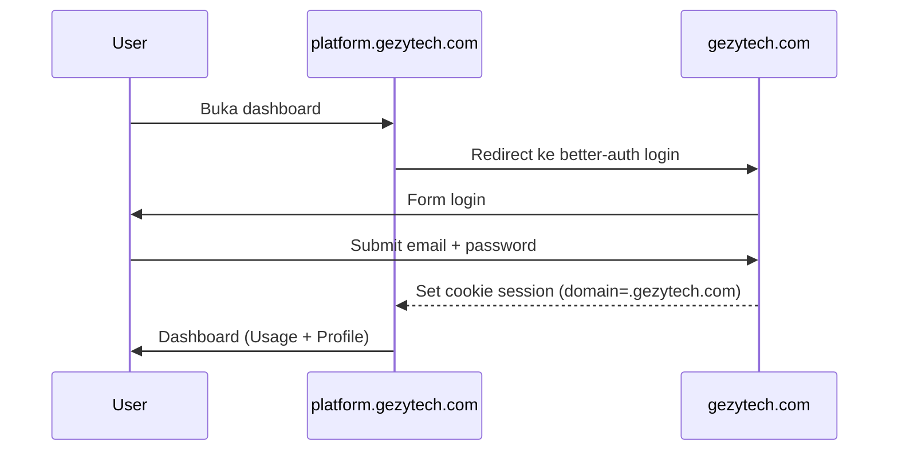

# PRD — GezyTech Platform App (User Dashboard)

> Dibuat: 9 Jul 2026 · Status: **DRAFT** · Versi: 1.0

---

## 1. Executive Summary

**GezyTech Platform** adalah aplikasi user dashboard untuk pengguna akhir GezyTech (`platform.gezytech.com`). Berbeda dengan web chat (`gezytech.com`) yang fokus ke percakapan agent, platform app fokus ke **akun, pemakaian, dan pembayaran**.

User login via SSO (better-auth), lalu mengakses:
- 📊 **Usage** — lihat pemakaian token per hari/minggu
- 💰 **TopUp** — isi saldo (manual dulu, Midtrans kemudian)
- 🧾 **Billing** — riwayat transaksi & invoice
- 👤 **Profile** — edit nama, email, ganti password

---

## 2. Arsitektur

### 2.1 Domain

```
gezytech.com              → web chat (public-app :3002)
platform.gezytech.com     → user dashboard (platform-app :3004)
admin.gezytech.com        → admin panel (gezytech :3003) — sudah ada
api.gezytech.com          → API (ke depannya kalau butuh)
```

### 2.2 Diagram alur login



### 2.3 Port & Security

| Port | Service | Exposure |
|------|---------|----------|
| 3002 | public-app (web chat) | Nginx → `:3002` |
| 3003 | gezytech (admin + agent) | Nginx → `:3003` (admin only) |
| **3004** | **platform-app backend** | Nginx → `:3004` |
| 5173 | Vite dev (MVP lokal) | localhost only |

### 2.4 Shared auth (SSO)

Platform-app TIDAK membuat auth sendiri. Pakai better-auth dari gezytech:

- Cookie session domain diset ke `.gezytech.com` → berlaku untuk semua subdomain
- Platform-app baca cookie `session` → verify ke gezytech `/api/auth/me`
- User login sekali, berlaku di semua aplikasi (web chat + platform)

---

## 3. Komponen

### 3.1 platform-app (frontend) — React + Vite

```
platform-app/
├── src/
│   ├── Dashboard.tsx     # Halaman utama: ringkasan usage + saldo
│   ├── Usage.tsx          # Detail pemakaian token (chart + tabel)
│   ├── Billing.tsx        # Riwayat topup + invoice
│   ├── Profile.tsx        # Edit nama, email, password
│   ├── TopUp.tsx          # Form topup (pilih nominal, metode bayar)
│   ├── useAuth.ts         # Hook auth (baca session dari gezytech)
│   ├── Layout.tsx         # Sidebar navigasi
│   ├── main.tsx           # Entry point + routing
│   └── style.css
├── index.html
├── vite.config.ts
├── package.json
└── tsconfig.json
```

**Routing:**
| Path | Halaman |
|------|---------|
| `/` | Dashboard (ringkasan) |
| `/usage` | Usage detail |
| `/topup` | TopUp form |
| `/billing` | Riwayat transaksi |
| `/profile` | Edit profile |

### 3.2 platform-app backend — Hono + Bun (port 3004)

```
platform-app/
├── server/
│   ├── index.ts       # Hono routes
│   ├── db.ts          # SQLite database
│   ├── migrate.ts     # Schema migration
│   ├── auth.ts        # SSO verify (call gezytech)
│   ├── usage.ts       # Token usage queries
│   ├── billing.ts     # Topup & billing logic
│   └── midtrans.ts    # Payment gateway (phase 2)
├── data/
│   └── platform.db    # SQLite database
```

### 3.3 gezytech (backend existing)

- better-auth untuk login
- `/api/auth/me` — endpoint verify session (sudah ada)
- `/api/agents/{slug}/messages` — untuk ambil data usage (opsional, bisa dari token_usage table)

---

## 4. Data Model

### 4.1 platform-app database (`platform-app/data/platform.db`)

```sql
-- User profile (extends gezytech user)
CREATE TABLE platform_users (
  user_id TEXT PRIMARY KEY,          -- FK ke gezytech user.id
  display_name TEXT,
  balance INTEGER NOT NULL DEFAULT 0, -- saldo dalam Rupiah
  created_at INTEGER NOT NULL,
  updated_at INTEGER NOT NULL
);

-- Top-up transactions
CREATE TABLE topup_transactions (
  id TEXT PRIMARY KEY,
  user_id TEXT NOT NULL REFERENCES platform_users(user_id),
  amount INTEGER NOT NULL,           -- Rupiah
  payment_method TEXT,               -- "transfer_bca" / "gopay" / "midtrans"
  status TEXT NOT NULL DEFAULT 'pending',  -- pending / success / failed / expired
  admin_note TEXT,                   -- catatan admin (approve/reject)
  midtrans_order_id TEXT,            -- dari Midtrans (phase 2)
  midtrans_token TEXT,               -- snap token (phase 2)
  created_at INTEGER NOT NULL,
  updated_at INTEGER NOT NULL
);

-- Daily token usage (agregasi per hari)
CREATE TABLE usage_daily (
  user_id TEXT NOT NULL,
  date TEXT NOT NULL,                -- "2026-07-09"
  input_tokens INTEGER NOT NULL DEFAULT 0,
  output_tokens INTEGER NOT NULL DEFAULT 0,
  total_tokens INTEGER NOT NULL DEFAULT 0,
  cost_estimate INTEGER NOT NULL DEFAULT 0,  -- estimasi dalam Rupiah
  PRIMARY KEY (user_id, date)
);

-- Usage pricing (admin-configurable)
CREATE TABLE pricing_config (
  id TEXT PRIMARY KEY,
  provider_slug TEXT NOT NULL,       -- "deepseek" / "openai"
  model_slug TEXT NOT NULL,          -- "deepseek-chat" / "gpt-4o"
  input_price_per_1m INTEGER,        -- harga per 1M input token (Rupiah)
  output_price_per_1m INTEGER,       -- harga per 1M output token (Rupiah)
  created_at INTEGER NOT NULL
);
```

### 4.2 Pricing default (contoh)

| Provider | Model | Input/1M | Output/1M |
|----------|-------|----------|-----------|
| DeepSeek | deepseek-chat | Rp 2.000 | Rp 8.000 |
| DeepSeek | deepseek-reasoner | Rp 4.000 | Rp 16.000 |
| OpenAI | gpt-4o | Rp 40.000 | Rp 160.000 |

---

## 5. Auth & Security

### 5.1 Auth flow

```
1. User buka platform.gezytech.com
2. Tidak ada cookie "session" → redirect ke gezytech.com/login
3. User login via better-auth (gezytech)
4. better-auth set cookie session dengan domain=.gezytech.com
5. Redirect balik ke platform.gezytech.com
6. Platform-app backend baca cookie → verify ke gezytech /api/auth/me
7. User terautentikasi → tampilkan dashboard
```

### 5.2 Logout

```
1. User klik logout di platform
2. Panggil gezytech /api/auth/logout
3. Cookie dihapus (domain=.gezytech.com)
4. Redirect ke landing page
```

### 5.3 Dev mode (MVP lokal)

```bash
DEV_MODE=true bun run server/index.ts
```

- Auto-login sebagai `dev@gezy.tech`
- Tidak perlu redirect ke gezytech

---

## 6. Fitur Detail

### 6.1 Dashboard (ringkasan)

**Tampilan:**
- 💰 **Saldo saat ini** (Rp XX.XXX)
- 📊 **Token terpakai bulan ini** (chart bar 30 hari)
- 📈 **Estimasi biaya bulan ini**
- 🔔 **Notifikasi** (saldo menipis, topup pending)

**API:**
```
GET /api/dashboard
→ { balance, usageThisMonth, estimatedCost, pendingTopups }
```

### 6.2 Usage (detail)

**Tampilan:**
- 📅 Filter: hari ini / minggu ini / bulan ini / custom range
- 📊 Chart bar: token per hari (input vs output)
- 📋 Tabel: per hari → input, output, total, estimasi biaya
- 📈 Progress bar: % kuota terpakai (kalau ada paket)

**API:**
```
GET /api/usage?from=2026-07-01&to=2026-07-09
→ { daily: [{date, inputTokens, outputTokens, totalTokens, costEstimate}], summary: {totalInput, totalOutput, totalCost} }
```

### 6.3 TopUp (isi saldo)

**MVP (manual):**
1. User pilih nominal (Rp 50.000 / 100.000 / 200.000 / custom)
2. Pilih metode: Transfer Bank (BCA)
3. Sistem generate nomor referensi + tampilkan nomor rekening admin
4. User transfer → admin lihat di admin panel → Approve
5. Saldo bertambah otomatis

**Phase 2 (Midtrans):**
1. User pilih nominal → klik "Bayar"
2. Midtrans Snap popup muncul (pilih bank/ewallet)
3. User bayar → Midtrans webhook → saldo bertambah otomatis
4. Tidak perlu admin approve

**API:**
```
POST /api/topup
→ { transactionId, amount, paymentMethod, bankAccount, referenceNumber }

GET /api/topup/status/:id
→ { status, amount, createdAt, paidAt }
```

### 6.4 Billing (riwayat)

**Tampilan:**
- 📋 Tabel: Tanggal, Deskripsi, Jumlah, Status
- 🔍 Filter: TopUp / Pemakaian / Semua
- 📥 Export CSV (opsional)

**API:**
```
GET /api/billing?type=topup|usage|all
→ { transactions: [{id, type, amount, status, createdAt}] }
```

### 6.5 Profile

**Tampilan:**
- 📝 Edit nama
- 📧 Email (read-only, dari gezytech)
- 🔑 Ganti password (panggil gezytech API)
- 🗑️ Hapus akun (soft delete)

**API:**
```
GET /api/profile
→ { displayName, email, createdAt }

PATCH /api/profile
→ { displayName }

POST /api/profile/change-password
→ proxy ke gezytech
```

---

## 7. API Endpoints (platform-app backend)

### Auth (proxy ke gezytech)
| Method | Path | Deskripsi |
|--------|------|-----------|
| GET | `/api/auth/me` | Verify session + return user |
| POST | `/api/auth/logout` | Logout |

### Dashboard
| Method | Path | Deskripsi |
|--------|------|-----------|
| GET | `/api/dashboard` | Ringkasan: saldo + usage bulan ini |

### Usage
| Method | Path | Deskripsi |
|--------|------|-----------|
| GET | `/api/usage?from=&to=` | Detail pemakaian token |

### TopUp
| Method | Path | Deskripsi |
|--------|------|-----------|
| POST | `/api/topup` | Buat transaksi topup (manual) |
| GET | `/api/topup/status/:id` | Cek status topup |
| GET | `/api/topup/history` | Riwayat topup user |
| POST | `/api/midtrans/webhook` | Webhook Midtrans (phase 2) |

### Billing
| Method | Path | Deskripsi |
|--------|------|-----------|
| GET | `/api/billing` | Riwayat semua transaksi |

### Profile
| Method | Path | Deskripsi |
|--------|------|-----------|
| GET | `/api/profile` | Data profile user |
| PATCH | `/api/profile` | Update display name |
| POST | `/api/profile/change-password` | Ganti password |

### Admin (internal, token-protected)
| Method | Path | Deskripsi |
|--------|------|-----------|
| GET | `/api/admin/topups` | List semua topup pending |
| POST | `/api/admin/topups/:id/approve` | Approve topup → saldo bertambah |
| POST | `/api/admin/topups/:id/reject` | Reject topup |
| GET | `/api/admin/users` | List semua user + saldo |
| POST | `/api/admin/pricing` | Update pricing config |

---

## 8. Struktur Folder

```
gezytech/
├── src/                    # gezytech backend (existing)
├── public-app/             # web chat (existing)
│   ├── server/
│   ├── src/
│   └── ...
├── platform-app/           # <<< BARU
│   ├── server/
│   │   ├── index.ts        # Hono routes (port 3004)
│   │   ├── db.ts           # SQLite
│   │   ├── migrate.ts      # Schema
│   │   ├── auth.ts         # SSO (verify ke gezytech)
│   │   ├── usage.ts        # Usage aggregation
│   │   ├── billing.ts      # Topup + billing
│   │   └── midtrans.ts     # Payment gateway (phase 2)
│   ├── src/                # React frontend
│   │   ├── Dashboard.tsx
│   │   ├── Usage.tsx
│   │   ├── TopUp.tsx
│   │   ├── Billing.tsx
│   │   ├── Profile.tsx
│   │   ├── Layout.tsx
│   │   ├── useAuth.ts
│   │   ├── main.tsx
│   │   └── style.css
│   ├── data/
│   │   └── platform.db
│   ├── index.html
│   ├── vite.config.ts
│   ├── package.json
│   └── tsconfig.json
├── Catatanku/
│   ├── gezytech-public/
│   └── gezytech-platform/  # <<< BARU
│       └── prd-gezytech-platform.md
└── ...
```

---

## 9. MVP Scope

### Phase 1 — MVP (lokal, 1-2 hari)
- [ ] Scaffold `platform-app/` (React + Hono)
- [ ] Database + migration
- [ ] SSO auth (verify ke gezytech)
- [ ] Profile (view + edit)
- [ ] Usage (chart + tabel)
- [ ] Dashboard ringkasan

### Phase 2 — TopUp (lokal, 1 hari)
- [ ] TopUp manual (generate ref → admin approve)
- [ ] Billing (riwayat transaksi)
- [ ] Admin panel: approve/reject topup

### Phase 3 — Midtrans (lokal, 0.5 hari)
- [ ] Integrasi Midtrans Snap
- [ ] Webhook handler
- [ ] Auto-approve on payment

### Phase 4 — VPS Deploy
- [ ] Nginx: `platform.gezytech.com` → `:3004`
- [ ] HTTPS via certbot
- [ ] systemd service

---

## 10. Yang Sudah Ada (dari gezytech)

| Komponen | Status | Keterangan |
|----------|--------|------------|
| better-auth | ✅ | Login, session, user management |
| `/api/auth/me` | ✅ | Verify session |
| User database | ✅ | `gezy.db` → tabel user |
| Token usage tracking | ✅ | Tabel `token_usage` di gezytech (bisa di-query untuk usage) |
| gezytech public-app | ✅ | Web chat, session, memory, etc. |
| Nginx di VPS | ⬇️ | Belum (ditunda ke EPIC-9) |

---

## 11. Risiko & Catatan

### 11.1 Saldo & pricing
- Saldo dalam Rupiah, bukan token — karena beda provider beda harga
- Pricing bisa diubah admin via config → tidak perlu deploy ulang
- Kalau saldo habis, agent tetap bisa chat? → Tergantung kebijakan (MVP: tetap bisa)

### 11.2 Usage tracking
- Data usage bisa dari `token_usage` table di public-app (sudah ada)
- Atau langsung dari gezytech API `/api/agents/{slug}/messages`
- Rekomendasi: dari `token_usage` public-app (sudah ter-record per user)

### 11.3 Payment gateway
- Midtrans perlu: merchant ID, server key, client key
- Webhook perlu endpoint publik (HTTPS) → baru bisa pas deploy VPS
- Untuk MVP lokal: simulasi dengan admin approve manual

### 11.4 SSO cookie domain
- `.gezytech.com` di localhost tidak bisa diset (domain harus ada dot)
- Solusi dev: `DEV_MODE=true` → bypass SSO → auto-login dev user
- Solusi prod: Nginx + domain beneran

### 11.5 Database terpisah
- Platform-app punya database sendiri (`platform.db`)
- Tidak menyentuh `gezy.db` atau `app.db` (public-app)
- Supaya loosely coupled — kalau platform-app mati, chat tetap jalan

---

## 12. Referensi

- [PRD GezyTech Public Web Chat](./prd-gezytech-public.md)
- [Issues GezyTech Public](../gezytech-public/issues-gezytech-public.md)
- [Diskusi Awal GezyTech Public](../gezytech-public/diskusi-awal.md)
- [Midtrans Snap Docs](https://docs.midtrans.com/docs/snap-overview)
- [better-auth Docs](https://www.better-auth.com/)

---

> **Next**: Buat issues di `issues-gezytech-platform.md` → mulai eksekusi MVP (Phase 1).
