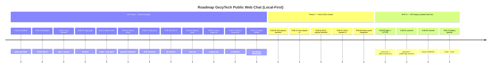

# Issues — GezyTech Public Web Chat (dari PRD)

> Turunan dari `prd-gezytech-public.md`. Urutan eksekusi = urutan di bawah.
> Estimasi dalam "story points" (1 SP ≈ 0.5 hari kerja).
>
> **Pendekatan**: MVP dikembangkan dan diuji **lokal di laptop** dulu.
> VPS deployment (Nginx, HTTPS, systemd, firewall) ditunda sampai MVP berfungsi
> sepenuhnya di lokal. Lihat EPIC-9 (VPS Deploy) untuk tugas-tugas VPS.

---

# EPIC-1 — Scaffolding & Infrastructure

## Issue PUB-00 — Scaffold public-app folder structure ✅ SELESAI

- **Labels**: `P0`, `phase-1`, `infrastructure`
- **Estimate**: 1
- **Depends-on**: —
- **Tujuan**: Buat struktur folder `public-app/` dengan React + Vite (frontend) dan Bun + Hono (backend), siap untuk development.
- **Tugas**
  - [x] Buat `gezytech/public-app/` dengan subfolder: `src/`, `server/`, `data/`, `dist/`
  - [x] Init `package.json` (name: gezytech-public, deps: react, react-dom, vite, hono, @hono/node-server, better-sqlite3)
  - [x] Setup `vite.config.ts` (React plugin, proxy `/api/` ke `localhost:3002` untuk dev)
  - [x] Setup `tsconfig.json`
  - [x] Buat entry points: `src/main.tsx`, `src/App.tsx`, `server/index.ts`
  - [x] Tes: `bun run dev` (frontend) + `bun run server` (backend) jalan tanpa error
- **Acceptance**: `public-app/` bisa di-build (`bun run build`) dan backend bisa start (`bun run server/index.ts`)

---

## Issue PUB-01 — Nginx reverse proxy + HTTPS ⬇️ DITUNDA KE EPIC-9 (VPS Deploy)

- **Labels**: `P3`, `vps-deploy`, `infrastructure`
- **Estimate**: 2
- **Depends-on**: MVP lokal selesai + EPIC-9 PUB-90
- **Tujuan**: Setup Nginx dengan HTTPS untuk `misal.com` (public-app) dan `admin.misal.com` (gezytech dashboard).
- **Status**: DITUNDA — fokus lokal dev dulu
- **Tugas**
  - [ ] Install Nginx + certbot di VPS
  - [ ] DNS: `misal.com` + `admin.misal.com` → VPS IP
  - [ ] Config Nginx: serve static files dari `public-app/dist/`, proxy `/api/` ke `localhost:3002`, proxy `admin.misal.com` ke `localhost:3000`
  - [ ] SSE support: `proxy_buffering off`, `proxy_cache off`
  - [ ] Certbot: obtain SSL certificate untuk `misal.com` + `admin.misal.com`
  - [ ] Firewall: hanya 22/80/443 terbuka (`ufw deny` semua port lain)
- **Acceptance**: `https://misal.com` menampilkan halaman (placeholder OK), `https://admin.misal.com` menampilkan gezytech dashboard

---

## Issue PUB-02 — systemd service untuk public-app backend ⬇️ DITUNDA KE EPIC-9 (VPS Deploy)

- **Labels**: `P3`, `vps-deploy`, `infrastructure`
- **Estimate**: 1
- **Depends-on**: MVP lokal selesai + EPIC-9 PUB-91
- **Tujuan**: public-app backend jalan via systemd, auto-restart, tidak exposed ke publik.
- **Status**: DITUNDA — fokus lokal dev dulu
- **Tugas**
  - [ ] Buat `/etc/systemd/system/gezytech-public.service`
  - [ ] Environment: `PORT=3002`, `GEZYTECH_API_URL=http://localhost:3000`, `GEZYTECH_SERVICE_TOKEN=<token>`
  - [ ] `systemctl enable` + `systemctl start`
  - [ ] Verifikasi: `curl localhost:3002/api/health` → OK, dari luar VPS → refused
- **Acceptance**: `systemctl status gezytech-public` → active (running), auto-restart on failure

---

# EPIC-2 — Auth & User Management

## Issue PUB-10 — public-app database & schema ✅ SELESAI

- **Labels**: `P0`, `phase-1`, `backend`
- **Estimate**: 2
- **Depends-on**: PUB-00
- **Tujuan**: SQLite database terpisah dengan 5 tabel: users, sessions, tool_requests, soul_requests, token_usage.
- **Tugas**
  - [x] Buat `server/db.ts` — koneksi SQLite (better-sqlite3 atau bun:sqlite)
  - [x] Buat migration: create 5 tabel sesuai PRD §4.1
  - [x] Seed 1 user dev: `dev@gezy.tech` / `devpass` / agent_slug: `wati` (atau agent yang ada di gezytech)
  - [x] CRUD helpers: createUser, getUserByEmail, getUserById, createSession, verifySession, deleteSession
- **Acceptance**: Database terbuat, seed user bisa di-query, helpers berfungsi

---

## Issue PUB-11 — Auth backend (login, logout, session) ✅ SELESAI

- **Labels**: `P0`, `phase-1`, `backend`
- **Estimate**: 3
- **Depends-on**: PUB-10
- **Tujuan**: Implementasi auth simple (email + password, cookie session).
- **Tugas**
  - [x] Password hashing: pakai bcrypt atau argon2 (bun:bcrypt atau @noble/hashes)
  - [x] `POST /api/auth/login` — verify email+password → create session → set cookie (httpOnly, secure, sameSite=lax)
  - [x] `POST /api/auth/logout` — delete session → clear cookie
  - [x] `GET /api/auth/me` — return user info (id, email, display_name, agent_slug) dari session cookie
  - [x] Middleware: `requireAuth()` — cek cookie → verify session → inject `ctx.user` ke request
  - [x] Dev mode: `DEV_MODE=true` → skip auth, hardcoded user
  - [x] Rate limit login: 5 attempt per 15 menit per IP
- **Acceptance**: Login → cookie set → `/api/auth/me` return user → logout → cookie cleared

---

## Issue PUB-12 — Login page (frontend) ✅ SELESAI

- **Labels**: `P0`, `phase-1`, `frontend`
- **Estimate**: 2
- **Depends-on**: PUB-11
- **Tujuan**: Halaman login GezyTech dengan branding.
- **Tugas**
  - [x] Halaman `/login` — form email + password
  - [x] Submit → `POST /api/auth/login` → success: redirect ke `/` (chat)
  - [x] Error handling: invalid credentials, network error
  - [x] Branding: logo GezyTech, warna tema
  - [x] Responsive: mobile + desktop
  - [x] Dev mode: skip login, langsung ke chat
- **Acceptance**: User bisa login dari browser, redirect ke chat page

---

## Issue PUB-13 — Admin user management (create user + map agent) ✅ SELESAI

- **Labels**: `P1`, `phase-1`, `backend`
- **Estimate**: 2
- **Depends-on**: PUB-10, PUB-11
- **Tujuan**: Admin bisa buat user baru + map ke agent di gezytech.
- **Tugas**
  - [x] `POST /api/admin/users` — create user (email, password, display_name, agent_slug)
  - [x] `GET /api/admin/users` — list all users
  - [x] `DELETE /api/admin/users/:id` — delete user
  - [x] Admin auth: env `ADMIN_TOKEN` atau admin user flag di DB
  - [x] CLI script: `bun run scripts/create-user.ts` — create user dari terminal (alternatif UI)
- **Acceptance**: Admin bisa create user via API atau CLI, user bisa login

---

# EPIC-3 — Chat (MVP Core)

## Issue PUB-20 — gezytech service token auth ✅ SELESAI

- **Labels**: `P0`, `phase-1`, `backend`
- **Estimate**: 2
- **Depends-on**: PUB-00
- **Tujuan**: gezytech menerima request dari public-app backend via service token (tanpa user login ke gezytech).
- **Tugas**
  - [x] Tambah middleware di gezytech: accept header `X-Service-Token: <token>`
  - [x] Env `GEZYTECH_SERVICE_TOKEN` di gezytech — validate incoming service token
  - [x] Endpoint atau modifikasi existing: chat dengan agent by `slug` (bukan by user session)
  - [x] Test: public-app backend kirim request dengan service token + agent_slug → gezytech process chat
- **Acceptance**: public-app backend bisa kirim chat request ke gezytech via service token, response streaming kembali

---

## Issue PUB-21 — Chat proxy backend (SSE streaming) ✅ SELESAI

- **Labels**: `P0`, `phase-1`, `backend`
- **Estimate**: 4
- **Depends-on**: PUB-11, PUB-20
- **Tujuan**: public-app backend proxy chat request ke gezytech, stream response ke browser via SSE.
- **Tugas**
  - [x] `POST /api/chat` — baca session → get agent_slug → proxy ke gezytech chat API
  - [x] Forward request: `X-Service-Token`, `agent_slug`, message content
  - [x] Stream SSE response dari gezytech → browser (passthrough, no buffering)
  - [x] Capture token usage dari SSE stream (parse `inputTokens` + `outputTokens` events)
  - [x] Save token usage ke `token_usage` table
  - [x] `GET /api/chat/history` — proxy ke gezytech history API (scoped ke agent_slug)
  - [x] Error handling: gezytech down, timeout, rate limit
- **Acceptance**: User kirim pesan → response stream real-time di browser, token usage tersimpan

---

## Issue PUB-22 — Chat interface (frontend lite) ✅ SELESAI

- **Labels**: `P0`, `phase-1`, `frontend`
- **Estimate**: 5
- **Depends-on**: PUB-12, PUB-21
- **Tujuan**: Chat interface lite version — mirip gezytech dashboard tapi simplified.
- **Tugas**
  - [x] Halaman `/` (chat) — cek session, redirect ke `/login` kalau belum login
  - [x] Message list: render user + agent messages, markdown support, auto-scroll
  - [x] Message input: textarea + send button, Enter to send, Shift+Enter newline
  - [x] SSE client: connect ke `/api/chat`, render streaming response real-time
  - [x] Tool call display: show tool name + truncated result (collapsible)
  - [x] Thinking/reasoning display: collapsible block
  - [x] Loading state: typing indicator saat agent berpikir
  - [x] Error state: network error, gezytech error
  - [x] Responsive: mobile (full width) + desktop (max-width container)
  - [x] Branding: GezyTech header/logo
  - [x] Chat history: load dari `/api/chat/history` saat page load
- **Acceptance**: User bisa chat dengan agent, response muncul real-time (streaming), markdown rendered, tool calls terlihat

---

# EPIC-4 — Memory & Token Usage

## Issue PUB-30 — Memory panel (read-only) ✅ SELESAI

- **Labels**: `P1`, `phase-1`, `frontend+backend`
- **Estimate**: 2
- **Depends-on**: PUB-21
- **Tujuan**: User bisa lihat memory agent mereka (read-only, tidak bisa hapus).
- **Tugas**
  - [x] `GET /api/memory` — proxy ke gezytech memory API (scoped ke agent_slug)
  - [x] Frontend: panel/sidebar memory list — text + created_at
  - [x] Search/filter memory
  - [x] Read-only: tidak ada tombol hapus/edit
  - [x] Empty state: "Agent belum punya memory"
  - [x] Responsive: collapsible sidebar di mobile
- **Acceptance**: User bisa lihat memory agent, tidak bisa hapus

---

## Issue PUB-31 — Token usage bar ✅ SELESAI

- **Labels**: `P1`, `phase-1`, `frontend+backend`
- **Estimate**: 2
- **Depends-on**: PUB-21
- **Tujuan**: Progress bar / counter token usage per user, update real-time.
- **Tugas**
  - [x] `GET /api/token-usage` — aggregate total tokens per user (input + output)
  - [x] Frontend: progress bar di header/sidebar
  - [x] Tampilkan: total tokens, breakdown input/output
  - [x] Update real-time setelah setiap pesan (dari SSE token event)
  - [x] Format: "12.5K tokens" (human-readable)
  - [x] Optional: chart history (7 hari terakhir)
- **Acceptance**: User bisa lihat token usage mereka, update setelah setiap pesan

---

# EPIC-5 — Tool Request (Phase 2)

## Issue PUB-40 — Tool request backend ✅ SELESAI

- **Labels**: `P2`, `phase-2`, `backend`
- **Estimate**: 2
- **Depends-on**: PUB-10, PUB-21
- **Tujuan**: Sistem tool request — user request tool, admin approve/reject.
- **Tugas**
  - [x] `POST /api/tool-request` — submit request (tool_name, reason) → status: pending
  - [x] `GET /api/tool-requests` — list user's requests + status
  - [x] `GET /api/admin/tool-requests` — list all requests (admin only)
  - [x] `PATCH /api/admin/tool-requests/:id` — approve/reject + admin_note
  - [x] Notifikasi: ketika approved/rejected, tampilkan badge di UI user
- **Acceptance**: User submit request → admin approve → user lihat status approved

---

## Issue PUB-41 — Tool request UI ✅ SELESAI

- **Labels**: `P2`, `phase-2`, `frontend`
- **Estimate**: 2
- **Depends-on**: PUB-40
- **Tujuan**: UI untuk user request tool + lihat status.
- **Tugas**
  - [x] Button "Request Tool" di sidebar/popup
  - [x] Form: dropdown tool list (dari gezytech tool catalog) + textarea alasan
  - [x] Status list: pending/approved/rejected + admin note
  - [x] Badge notifikasi kalau ada update status
- **Acceptance**: User bisa request tool, lihat status request

---

# EPIC-6 — SOUL Request (Phase 2)

## Issue PUB-50 — SOUL request backend

- **Labels**: `P2`, `phase-2`, `backend`
- **Estimate**: 2
- **Depends-on**: PUB-10
- **Tujuan**: Sistem SOUL request — user ajukan persona, admin review + edit di gezytech.
- **Tugas**
  - [ ] `POST /api/soul-request` — submit request (soul_text) → status: pending
  - [ ] `GET /api/soul-requests` — list user's requests + status
  - [ ] `GET /api/admin/soul-requests` — list all requests (admin only)
  - [ ] `PATCH /api/admin/soul-requests/:id` — approve/reject + admin_note
  - [ ] Integration: admin approve → link ke gezytech dashboard tab SOUL (atau auto-apply)
- **Acceptance**: User submit SOUL request → admin review → approve → SOUL applied ke agent

---

## Issue PUB-51 — SOUL request UI

- **Labels**: `P2`, `phase-2`, `frontend`
- **Estimate**: 2
- **Depends-on**: PUB-50
- **Tujuan**: UI untuk user request persona change + lihat status.
- **Tugas**
  - [ ] Button "Request Persona Change"
  - [ ] Form: textarea SOUL text + preview
  - [ ] Status list: pending/approved/rejected + admin note
  - [ ] Info: "Admin akan review dan mengubah persona agent kamu"
- **Acceptance**: User bisa ajukan SOUL custom, lihat status

---

# EPIC-7 — Admin Integration (gezytech dashboard)

## Issue PUB-60 — Admin panel: tool & SOUL requests di gezytech dashboard ✅ SELESAI

- **Labels**: `P2`, `phase-2`, `frontend+backend`
- **Estimate**: 3
- **Depends-on**: PUB-40, PUB-50
- **Tujuan**: Admin lihat + approve/reject tool/SOUL requests dari gezytech dashboard (atau public-app admin panel).
- **Tugas**
  - [x] Baca dari public-app DB (atau public-app expose admin API)
  - [x] UI di admin.misal.com: list tool requests + SOUL requests
  - [x] Approve/reject button + admin note
  - [x] Tool approve → update agent toolbox di gezytech
  - [x] SOUL approve → update agent character di gezytech (link ke tab SOUL atau auto-apply)
- **Acceptance**: Admin bisa approve/reject dari dashboard, perubahan langsung apply ke agent

---

# EPIC-8 — Deployment & Polish

## Issue PUB-70 — Build & deploy pipeline ⬇️ DITUNDA KE EPIC-9 (VPS Deploy)

- **Labels**: `P3`, `vps-deploy`, `infrastructure`
- **Estimate**: 1
- **Depends-on**: MVP lokal selesai + PUB-90 + PUB-91
- **Tujuan**: Pipeline build di laptop → rsync ke VPS → restart service.
- **Status**: DITUNDA — fokus lokal dev dulu
- **Tugas**
  - [ ] Build script: `bun run build` (frontend) + `bun run server/build` (backend jika perlu)
  - [ ] Deploy script: rsync `dist/` + `server/` + `data/` ke VPS
  - [ ] Restart: `systemctl restart gezytech-public`
  - [ ] Health check: `curl localhost:3002/api/health` post-deploy
- **Acceptance**: Deploy dari laptop ke VPS dalam 1 perintah, service restart otomatis

---

## Issue PUB-71 — Polish & responsive ✅ SELESAI

- **Labels**: `P2`, `phase-1`, `frontend`
- **Estimate**: 2
- **Depends-on**: PUB-22, PUB-30, PUB-31
- **Tujuan**: Final polish UI — responsive, dark mode, loading states, error states.
- **Tugas**
  - [x] Mobile responsive: chat, memory, token bar bekerja di 360px
  - [x] Dark mode (optional, kalau gezytech punya theme system)
  - [x] Loading states: skeleton/spinner untuk chat, memory, token
  - [x] Error states: network error, gezytech down, session expired
  - [x] Empty states: no chat history, no memory, no token usage
  - [x] Favicon + PWA manifest (GezyTech branding)
- **Acceptance**: UI polished, responsive, tidak ada broken state

---

## Issue PUB-72 — Sidebar history percakapan

- **Labels**: `P1`, `phase-1`, `frontend+backend`
- **Estimate**: 3
- **Depends-on**: PUB-22
- **Tujuan**: Sidebar di kiri/samping chat yang menampilkan daftar percakapan sebelumnya. User bisa klik percakapan lama untuk melihat history-nya.
- **Tugas**
  - [ ] Backend: update `GET /api/chat/history` untuk proxy ke gezytech messages API (dengan service token + agent_slug)
  - [ ] Frontend: komponen `HistoryPanel.tsx` — sidebar dengan list percakapan (grouped by date/session)
  - [ ] Setiap item: preview text (50-80 karakter pertama), timestamp, clickable
  - [ ] Klik item → load history percakapan tersebut ke chat view
  - [ ] Responsive: sidebar collapsible di mobile (hamburger/toggle)
  - [ ] Active state: percakapan yang sedang aktif di-highlight
  - [ ] Empty state: "No conversations yet"
- **Acceptance**: Sidebar muncul di kiri chat, menampilkan list percakapan, bisa diklik untuk lihat history

---

# EPIC-9 — VPS Deploy (setelah MVP lokal selesai)

> Semua tugas di epic ini dijalankan **setelah** MVP berfungsi sepenuhnya di laptop.
> Lihat `prd-gezytech-public.md` §9 (Deployment) untuk detail.

## Issue PUB-90 — Nginx reverse proxy + HTTPS (VPS)

- **Labels**: `P0`, `vps-deploy`, `infrastructure`
- **Estimate**: 2
- **Depends-on**: MVP lokal selesai
- **Tujuan**: Setup Nginx dengan HTTPS untuk `misal.com` dan `admin.misal.com`.
- **Tugas**
  - [ ] Install Nginx + certbot di VPS
  - [ ] DNS: `misal.com` + `admin.misal.com` → VPS IP
  - [ ] Config Nginx (lihat PRD §8 untuk full config)
  - [ ] SSE support: `proxy_buffering off`, `proxy_cache off`
  - [ ] Certbot: obtain SSL certificate
- **Acceptance**: `https://misal.com` menampilkan public-app, `https://admin.misal.com` menampilkan gezytech dashboard

---

## Issue PUB-91 — systemd services (VPS)

- **Labels**: `P0`, `vps-deploy`, `infrastructure`
- **Estimate**: 1
- **Depends-on**: MVP lokal selesai
- **Tujuan**: gezytech + public-app backend jalan via systemd, auto-restart.
- **Tugas**
  - [ ] Update `gezytech.service` (sudah ada, pastikan port 3000 internal)
  - [ ] Buat `gezytech-public.service` (port 3002, internal)
  - [ ] `systemctl enable` + `systemctl start` keduanya
  - [ ] Verifikasi: `curl localhost:3002/api/health` → OK, dari luar VPS → refused
- **Acceptance**: Kedua service active (running), auto-restart on failure

---

## Issue PUB-92 — Firewall & security hardening (VPS)

- **Labels**: `P0`, `vps-deploy`, `security`
- **Estimate**: 1
- **Depends-on**: PUB-90, PUB-91
- **Tujuan**: Hanya port 22/80/443 terbuka ke publik. Semua port lain ditutup.
- **Tugas**
  - [ ] `ufw default deny incoming`
  - [ ] `ufw allow 22/tcp` (SSH)
  - [ ] `ufw allow 80/tcp` (HTTP)
  - [ ] `ufw allow 443/tcp` (HTTPS)
  - [ ] `ufw enable`
  - [ ] Verifikasi: port 3000 + 3002 tidak accessible dari luar
- **Acceptance**: `nmap` dari luar hanya menunjukkan 22, 80, 443 terbuka

---

# Roadmap (urutan rekomendasi) — UPDATED

---

## Ringkasan Estimasi — UPDATED

| Epic | Issues | Σ points | Fase |
|---|---|---|---|
| EPIC-1 Scaffolding | PUB-00 | 1 | MVP lokal |
| EPIC-2 Auth | PUB-10, PUB-11, PUB-12, PUB-13 | 2+3+2+2 = 9 | MVP lokal |
| EPIC-3 Chat | PUB-20, PUB-21, PUB-22 | 2+4+5 = 11 | MVP lokal |
| EPIC-4 Memory & Token | PUB-30, PUB-31 | 2+2 = 4 | MVP lokal |
| EPIC-8 Polish & History | PUB-71, PUB-72 | 2+3 = 5 | MVP lokal |
| EPIC-5 Tool Request | PUB-40, PUB-41 | 2+2 = 4 | Phase 2 lokal |
| EPIC-6 SOUL Request | PUB-50, PUB-51 | 2+2 = 4 | Phase 2 lokal |
| EPIC-7 Admin Integration | PUB-60 | 3 | Phase 2 lokal |
| EPIC-9 VPS Deploy | PUB-90, PUB-91, PUB-92, PUB-70 | 2+1+1+1 = 5 | VPS deploy |
| **Total** | **20 issues** | **48** | |

**MVP lokal**: 10 issues, ~27 SP (~13.5 hari kerja)
**Phase 2 lokal**: 5 issues, ~11 SP (~5.5 hari kerja)
**VPS Deploy**: 4 issues, ~5 SP (~2.5 hari kerja)

---

## Definition of Done (gabungan)

### Untuk MVP lokal:

- [ ] Kode pass typecheck (`tsc --noEmit`)
- [ ] Tidak ada test eksisting yang gagal (regresi = 0)
- [ ] `bun run dev` (frontend) + `bun run server` (backend) jalan tanpa error di laptop
- [ ] SSE streaming berfungsi end-to-end (gezytech → public-app → browser) di localhost
- [ ] Session isolation: user A tidak bisa akses agent user B
- [ ] Token usage tercatat per user
- [ ] Login → chat → memory → token bar, semua berfungsi di `localhost:5173`

### Untuk VPS deploy (EPIC-9):

- [ ] Nginx config tested: `https://misal.com` dan `https://admin.misal.com` berfungsi
- [ ] Port 3000 + 3002 tidak accessible dari luar VPS
- [ ] Firewall: hanya 22/80/443 terbuka
- [ ] Deploy pipeline: 1 perintah dari laptop ke VPS

---

## Catatan keterbatasan

- gezytech API belum punya service-to-service auth — PUB-20 perlu tambahan middleware di gezytech
- SSE streaming melalui 2 proxy (public-app backend → Nginx → browser) — perlu test latency
- Token tracking parse dari SSE stream — format event gezytech perlu diverifikasi
- Admin panel untuk tool/SOUL request bisa di gezytech dashboard atau public-app admin — keputusan implementasi nanti
- Domain `misal.com` adalah placeholder — ganti dengan domain asli saat deploy

---

*File ini turunan dari `prd-gezytech-public.md`. MVP dikembangkan lokal dulu, VPS deploy di EPIC-9. Implementasi bertahap, per issue, dengan validasi tiap issue.*
