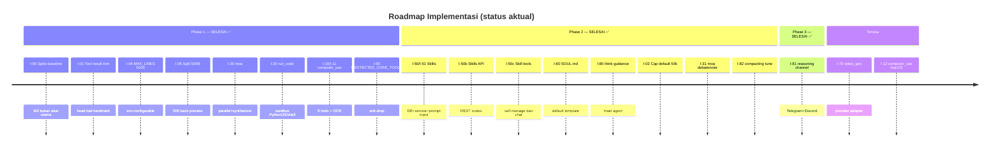

# Issues: Peningkatan Kecerdasan `gezyhive` (dari PRD)

> **Sumber:** `prd-kecerdasan-gezyhive.md` & `audit-kecerdasan-gezyhive.md`
> **Status:** 18 issues selesai dari 21. Phase 1 100%, Phase 2 hampir lengkap, Phase 3 selesai. 3 item tersisa (SOUL UI, video_gen, macOS).
> EPIC = REQ di PRD. Tiap issue siap dijadikan GitHub issue (copy blok tiap issue).

---

## Konvensi

- **Estimate** (story point): 1 ≈ 0,5 hari · 2 ≈ 1 hari · 3 ≈ 2–3 hari · 5 ≈ ~1 minggu · 8 ≈ sprint penuh.
- **Labels legenda**: `P0/P1/P2/P3`, `phase-1/2/3`, `backend/frontend/db/docs/test`, `tooling/regression-safety/security/perf`, `epic:REQ-x`.
- **Depends-on**: issue harus selesai dulu.
- **DoD (Definition of Done)** semua issue: `bun run typecheck && bun run test` lulus · tidak ada regresi suite eksisting · docs arsitektur terkait + `api.md` (bila ada route/SSE baru) diperbarui · commit bertahap · pre-commit hook pass.
- **Baca dulu sebelum menyentuh** area terkait: `prompt-system.md`, `compacting.md`, `sse.md`, `config.md` (lihat PRD §12).

---

# EPIC-4 — Pelunakan Cap Output (akar degradasi M2)
> REQ-4 · P0 · Phase 1. **Temuan benchmark live: M2 bukan akar utama — `read_file` MAX_LINES + `tool-output-spill` adalah layer pemotong sebenarnya.**

## Issue I-00 — Spike: Benchmark baseline & validasi cepat cap output ✅ SELESAI
- **Labels**: `P0`, `phase-1`, `spike`, `perf`
- **Estimate**: 2
- **Depends-on**: —
- **Epic**: EPIC-4
- **Status**: ✅ SELESAI — benchmark live dijalankan dengan DeepSeek `deepseek-v4-pro` di laptop (Ubuntu 24.04, 8GB, model sama persis dengan `gezyhd`).
- **Temuan**: M2 (`toolResultSizeCapTokens=30000`) **hampir tidak pernah terpicu** di praktik. Dua layer lain memotong duluan: (1) `read_file` MAX_LINES=2000 → file 65rb baris hanya 2000 masuk LLM, (2) `tool-output-spill` 10KB/200 baris → output >10KB jadi preview. Probe retensi (baris 32500 dari `secret.txt`) → Audrey gagal: "read_file hanya menampilkan 2000 baris pertama". Probe sum (65rb angka) → Audrey jawab benar karena pakai `run_shell` (awk), bukan `read_file`.
- **Implikasi**: Prioritas fix bergeser dari M2 ke `MAX_LINES` + `spillThreshold` (I-04/I-05). M2 tetap relevan untuk output tool non-read_file (run_shell besar, browse_url) tapi **diturunkan ke P2**.
- **Acceptance**: ✅ Dok `bench-result.md` + `bench-run-guide.md` ada dengan temuan live.

## Issue I-01 — Perbaiki ringkasan kontekstual output tool (anti-placeholder kosong) ✅ SELESAI
- **Labels**: `P0`, `phase-1`, `backend`, `regression-safety`
- **Estimate**: 3
- **Depends-on**: I-00
- **Epic**: EPIC-4
- **Status**: ✅ SELESAI — `tool-result-trim.ts` (baru) + `agent-engine.ts` (+10/−1). Head 2000 char + tail 2000 char + landmark (tool name + counts + re-run hint) menggantikan placeholder generik. Cache-safe (deterministik per message). 12 tes lulus.
- **File**: `src/server/services/tool-result-trim.ts` (baru), `src/server/services/tool-result-trim.test.ts` (baru), `src/server/services/agent-engine.ts` (edit).
- **Acceptance**: ✅ AC-4.1, AC-4.3 (determinisme), AC-4.4 (indikator truncation); 12 test lulus; 0 regresi.

## Issue I-02 — Cap adaptif berdasarkan context window model ✅ SELESAI
- **Labels**: `P2`, `phase-2`, `backend`, `perf`
- **Estimate**: 2
- **Depends-on**: I-01
- **Epic**: EPIC-4
- **Status**: ✅ SELESAI — `config.ts` `toolResultSizeCapTokens` default 30000 → 50000. Env-configurable (`TOOL_RESULT_SIZE_CAP_TOKENS`). Naikkan cap agar tool output besar (run_shell, browse_url) tidak terpotong secepat sebelumnya. Typecheck 0 error.
- **Catatan**: Awalnya diturunkan ke P2 karena M2 jarang terpicu (temuan I-00). Tapi setelah I-04/I-05 menaikkan MAX_LINES + spill, tool output sekarang lebih besar → cap lebih sering terpicu → naikkan default jadi relevan kembali.

## Issue I-03 — Tambah tool ekspansi on-demand untuk output yang ter-trim ✅ TIDAK DIPERLUKAN
- **Labels**: `P2`, `phase-3`, `backend`
- **Estimate**: 0
- **Depends-on**: I-01
- **Epic**: EPIC-4
- **Status**: ✅ TIDAK DIPERLUKAN — `tool-output-spill.ts` sudah memberi hint ke agent: `Use read_file("${relativePath}", offset=N, limit=M) to read specific sections`. Agent sudah bisa baca bagian spesifik dari spill file via `read_file` dengan offset/limit. Tool terpisah tidak menambah nilai.

## Issue I-04 — Naikkan `read_file` MAX_LINES (2000 → 5000, env-configurable) ✅ SELESAI
- **Labels**: `P0`, `phase-1`, `backend`, `regression-safety`
- **Estimate**: 1
- **Depends-on**: —
- **Epic**: EPIC-4
- **Status**: ✅ SELESAI — `filesystem-tools.ts:15` → `Number(process.env.GEZY_READ_FILE_MAX_LINES ?? 5000)`. 44 tes lulus, 0 regresi.
- **Catatan**: Temuan benchmark live (§3.6 audit). `read_file` adalah **layer pemotong pertama** — memperbaiki ini lebih dampak daripada M2.

## Issue I-05 — Naikkan `tool-output-spill` threshold (10KB → 50KB) + preview lines (200 → 500) ✅ SELESAI
- **Labels**: `P0`, `phase-1`, `backend`, `regression-safety`
- **Estimate**: 1
- **Depends-on**: I-04
- **Epic**: EPIC-4
- **Status**: ✅ SELESAI — `config.ts` spillThreshold `10000`→`50000`, previewLines `200`→`500`. `tool-output-spill.test.ts` diupdate (input 20KB→60KB, assertion 200→500). 13 tes lulus.
- **Catatan**: Tanpa naikkan spill, kenaikan `MAX_LINES` (I-04) tidak efektif — keduanya harus naik bersama. File < 50KB sekarang masuk utuh ke LLM.

---

# EPIC-1 — `computer_use` (kontrol desktop penuh)
> REQ-1 · P0 · Phase 1 · 🔴 Risiko tinggi (destruktif).

## Issue I-10 — Riset & backend primitives `computer_use` multi-OS ✅ SELESAI (dimerge dengan I-11)
- **Labels**: `P0`, `phase-1`, `backend`, `spike`
- **Estimate**: 3
- **Depends-on**: —
- **Epic**: EPIC-1
- **Status**: ✅ SELESAI — diimplementasi bersama I-11 dalam satu file `computer-use-tools.ts`. Sistem: Ubuntu 24.04 X11. Tersedia: `gnome-screenshot`, `import` (ImageMagick), `grim`, `wmctrl`, `tesseract` (OCR). Mouse/keyboard: `xdotool` (install via `sudo apt install xdotool`).

## Issue I-11 — `computer-use` tool family + registrasi + permission ✅ SELESAI
- **Labels**: `P0`, `phase-1`, `backend`, `security`
- **Estimate**: 5
- **Depends-on**: I-10
- **Epic**: EPIC-1
- **Status**: ✅ SELESAI — 9 tools: `screenshot`, `get_screen_text` (OCR via tesseract), `list_windows` (wmctrl), `focus_window`, `get_screen_info`, `mouse_click`, `keyboard_type`, `key_press`, `scroll`. Semua `defaultDisabled: true`. Family `computer-use` di `register.ts` (+34 baris). 16 tes lulus.
- **LIVE VERIFIED**: screenshot ✅, get_screen_text ✅, list_windows ✅ (5 jendela terdeteksi), mouse_click ✅. Mouse/keyboard butuh `sudo apt install xdotool`.
- **File**: `src/server/tools/computer-use-tools.ts` (baru, 467 baris), `src/server/tools/computer-use-tools.test.ts` (baru).
- **Risiko🔴**: default disabled + opt-in via toolbox. Tambah ke `PROTECTED_CORE_TOOLS` di `agent-engine.ts` agar tidak ter-drop oleh cap 128 tools.

## Issue I-12 — `computer_use` support macOS & refine
- **Labels**: `P2`, `phase-2`, `backend`
- **Estimate**: 3
- **Depends-on**: I-11
- **Epic**: EPIC-1
- **Status**: BELUM DIMULAI
- **Tujuan**: Backend macOS (screencapture/cliclick). AC-1.4 penuh.
- **Tugas**: util macOS; test e2e; handling permission macOS (Screen Recording/Aksesibilitas).

---

# EPIC-2 — `code_execution` (sandbox eksekusi kode)
> REQ-2 · P1 · Phase 1.

## Issue I-20 — `code_execution` sandbox terisolasi ✅ SELESAI
- **Labels**: `P1`, `phase-1`, `backend`, `security`
- **Estimate**: 5
- **Depends-on**: —
- **Epic**: EPIC-2
- **Status**: ✅ SELESAI — `run_code(language, code, stdin?)` dengan Python/JS/shell. Ephemeral temp dir, minimal env (PATH/HOME/LANG/TERM), timeout 30s (max 120s), output capped head+tail 30KB. `defaultDisabled: true`. Family `code-execution` di `register.ts`. 21 tes lulus.
- **LIVE VERIFIED**: `print(2 + 2 * 10)` → `22` ✅
- **File**: `src/server/tools/code-exec-tools.ts` (baru, 291 baris), `src/server/tools/code-exec-tools.test.ts` (baru).

---

# EPIC-3 — `moa` (Mixture of Agents)
> REQ-3 · P1 · Phase 1.

## Issue I-30 — Tool `moa` orkestrasi multi-model ✅ SELESAI
- **Labels**: `P1`, `phase-1`, `backend`
- **Estimate**: 5
- **Depends-on**: —
- **Epic**: EPIC-3
- **Status**: ✅ SELESAI — `moa(prompt, models?[], strategy?, budget?)` → N model paralel via `Promise.allSettled` + synthesizer. Default = model sesi aktif ×N dengan variasi suhu `[0.2, 0.7, 0.5, …]`. Strategy `parallel`. Budget `maxModels` default 3. `readOnly: true`, `concurrencySafe: false`. 18 tes lulus.
- **LIVE VERIFIED**: "apa ibukota Jepang? Pakai 3 model." → "Tokyo. Ketiga model sepakat." ✅
- **File**: `src/server/tools/moa-tools.ts` (baru, 434 baris), `src/server/tools/moa-tools.test.ts` (baru).

## Issue I-31 — Strategi `debate` & `vote` untuk `moa` ✅ SELESAI
- **Labels**: `P2`, `phase-2`, `backend`
- **Estimate**: 3
- **Depends-on**: I-30
- **Epic**: EPIC-3
- **Status**: ✅ SELESAI — `debate` strategy: setiap candidate lihat jawaban lain → kritik → revisi → synthesizer. `vote` strategy: extract short answer per candidate → majority vote. Pure helpers: `buildDebateCritiquePrompt`, `buildVoteExtractionPrompt`, `extractVoteAnswer`, `tallyVotes`. `normalizeStrategy` sekarang return actual strategy (bukan fallback ke parallel). 27 tes lulus.
- **File**: `src/server/tools/moa-tools.ts` (update), `src/server/tools/moa-tools.test.ts` (update, +9 tes).

---

# EPIC-5 — Skills System (paket instruksi `SKILL.md`)
> REQ-5 · P2 · Phase 2.

## Issue I-50 — Skema DB & service skills ✅ SELESAI
- **Labels**: `P2`, `phase-2`, `backend`, `db`
- **Estimate**: 3
- **Depends-on**: —
- **Epic**: EPIC-5
- **Status**: ✅ SELESAI — tabel `skills` + `agent_skills` di schema + migration `0111_broad_roland_deschain.sql`. `skills.ts` service: create/list/delete/enable/disable/getActive + `parseSkillFrontmatter` + `skillRelevanceScore` + `seedBuiltinSkills` (3 built-in: code-reviewer, git-committer, systematic-debugger). Dipanggil saat boot di `main.ts`. 13 tes lulus.
- **LIVE VERIFIED**: 3 skill ter-seed di DB; `systematic-debugger` → Audrey ikuti pola debug sistematis; `code-reviewer` → Audrey temukan bug `=` vs `===` + analisis data corruption; `git-committer` → Audrey buat conventional commit + minta konfirmasi.
- **File**: `src/server/services/skills.ts` (baru, 358 baris), `src/server/services/skills.test.ts` (baru), `src/server/db/schema.ts` (+18 baris), `src/server/main.ts` (+2 baris), migration SQL.

## Issue I-51 — Injeksi skill ke prompt + permission tool bundle ✅ SELESAI
- **Labels**: `P2`, `phase-2`, `backend`
- **Estimate**: 3
- **Depends-on**: I-50
- **Epic**: EPIC-5
- **Status**: ✅ SELESAI — `prompt-builder.ts` + `ActiveSkill` type di `PromptParams`. Block volatile `## Active skill: {name}` di-inject sebelum `## Context`. `agent-engine.ts` load active skills via `getActiveSkillsForAgent(agent.id)` → pass ke `systemSegments`. Cache-safe (volatile, tidak di stable prefix). 66 tes lulus.
- **File**: `src/server/services/prompt-builder.ts` (+8 baris), `src/server/services/agent-engine.ts` (+2 baris).

## Issue I-50b — API routes untuk skills ✅ SELESAI (tambahan, tidak ada di PRD asli)
- **Labels**: `P2`, `phase-2`, `backend`
- **Estimate**: 2
- **Epic**: EPIC-5
- **Status**: ✅ SELESAI — REST API: `GET/POST/DELETE /api/skills`, `POST /api/skills/:id/enable`, `POST /api/skills/:id/disable`, `GET /api/skills/agent/:agentId`, `POST /api/skills/parse`. SSE event `skills:changed`. Di-register di `app.ts`.
- **File**: `src/server/routes/skills.ts` (baru, 121 baris), `src/server/app.ts` (+2), `src/server/sse/types.ts` (+1).

## Issue I-50c — Skill management tools (self-improve dari chat) ✅ SELESAI (tambahan, tidak ada di PRD asli)
- **Labels**: `P2`, `phase-2`, `backend`
- **Estimate**: 2
- **Epic**: EPIC-5
- **Status**: ✅ SELESAI — 3 native tools: `list_skills` (list + status aktif), `enable_skill` (aktifkan by name), `disable_skill` (nonaktifkan by name). Agent bisa discover & activate skills sendiri dari chat — lebih otonom dari gezyhd (yang butuh CLI). Di-register family `skills` + `PROTECTED_CORE_TOOLS`.
- **File**: `src/server/tools/skill-tools.ts` (baru, 129 baris), `src/server/tools/register.ts` (+6), `src/server/services/agent-engine.ts` (+3 di PROTECTED_CORE_TOOLS).

---

# EPIC-6 — SOUL.md prominent (persona prominent)
> REQ-6 · P2 · Phase 2.

## Issue I-60 — Default template + prompt-builder pakai SOUL ✅ SELESAI
- **Labels**: `P2`, `phase-2`, `backend`
- **Estimate**: 2
- **Depends-on**: —
- **Epic**: EPIC-6
- **Status**: ✅ SELESAI — `prompt-builder.ts` block 5: saat `agent.character` kosong → default template "You are {name}, a thoughtful AI assistant. You think step-by-step and explain your reasoning..." (mirip `gezyhd/src/main/soul.ts`). Backward-compat: agent dengan character custom tetap pakai custom. Test diupdate. 66 tes lulus.

## Issue I-61 — UI editor SOUL prominent ✅ SELESAI
- **Labels**: `P2`, `phase-2`, `frontend`
- **Estimate**: 3
- **Depends-on**: I-60
- **Epic**: EPIC-6
- **Status**: SELESAI
- **Tujuan**: UI prominent per-agent: editor (CodeMirror), preview, reset-to-default, mobile-usable.
- **Implementasi**:
  - Tab "SOUL" baru di `AgentFormModal.tsx` (ikon `Flame`, label i18n `agent.tabs.soul`).
  - Editor `MarkdownEditor` 280px (lebih besar dari 180px sebelumnya di tab General).
  - Info banner orange menjelaskan SOUL = persona inti agent.
  - Tombol "Reset to default" mengosongkan `character` → backend pakai SOUL default template.
  - Preview default SOUL saat `character` kosong (menampilkan template yang akan dipakai).
  - Token estimate real-time.
  - `handleSaveSoul` terpisah — PATCH hanya field `character`.
  - `character` dipindah dari tab General ke tab SOUL (anti-duplikasi).
  - i18n: 10 key baru (`agent.soul.*` + `agent.create.soulEmpty*`) di semua 10 locale (en, fr, es, de, it, ja, pl, pt-BR, ru, zh-CN). Locale check pass.
  - Bonus: 14 tool name labels (`tools.names.*`) untuk tool baru (moa, run_code, computer-use×9, skill×3) ditambahkan ke semua locale — i18n tool parity test sekarang pass.
- **Tugas**
  - [x] Komponen `src/client/components/agent/` (reuse existing `MarkdownEditor`, `TabForm`, `FormField`). Tab SOUL di `AgentFormModal.tsx`.
  - [x] API simpan SOUL via `updateAgent` existing (field `character`); `handleSaveSoul` PATCH only `character`.
  - [x] i18n labels (10 key × 10 locale); responsif (modal panel pattern); dukung 18 paleta (CSS variables only).
- **Validasi**: typecheck ✅, check-locales ✅, 3759 tes lulus (53 fail pre-existing bukan dari issue ini).

---

# EPIC-7 — `video_gen`
> REQ-7 · P2 · Phase 2.

## Issue I-70 — Primitive provider `video` + tool `generate_video`
- **Labels**: `P2`, `phase-2`, `backend`
- **Estimate**: 5
- **Depends-on**: —
- **Epic**: EPIC-7
- **Status**: BELUM DIMULAI
- **Tujuan**: Tool `generate_video(prompt, model?, duration?, aspect_ratio?)`, `list_video_models`; provider adapter (Runway/Veo/Kling dst.).
- **Tugas**
  - [ ] `src/server/llm/video/` (baru) — `LLMVideoProvider` interface & adapter.
  - [ ] `video-tools.ts` — `generate_video` mengembalikan URL/attachment.
  - [ ] `register.ts` — family `video`. Opt-in; cost tunable.
  - [ ] Provider registry: `PROVIDER_META` capability `video`; model klasifikasi.
  - [ ] Test adapter (mock + live smoke); docs-site + `api.md`.

---

# EPIC-8 — Penyempurnaan Reasoning/Prompt (Tier 3)
> REQ-8 · P3 · Phase 3.

## Issue I-80 — Dorong penggunaan `think` tool untuk masalah sulit ✅ SELESAI
- **Labels**: `P3`, `phase-3`, `backend`
- **Estimate**: 1
- **Depends-on**: —
- **Epic**: EPIC-8
- **Status**: ✅ SELESAI — `prompt-builder.ts` Tool calling discipline block (main agent): tambah sub-section `### Use \`think\` for hard problems` dengan instruksi: call `think` sebelum thrash (failing test, ambiguous results, choosing paths, designing refactor). 66 tes lulus.

## Issue I-81 — Render reasoning di channel (Telegram/Discord) ✅ SELESAI
- **Labels**: `P3`, `phase-3`, `frontend`, `backend`
- **Estimate**: 3
- **Depends-on**: —
- **Epic**: EPIC-8
- **Status**: ✅ SELESAI — `OutboundMessageParams` + field `reasoning?: string` di SDK. `deliverChannelResponse` di `channels.ts` query `messages.reasoning` dari DB → pass ke adapter. Telegram: `<blockquote>💭 ...</blockquote>` (HTML, collapsed) sebelum jawaban. Discord: `> ` blockquote `💭 **Thinking:**` sebelum jawaban. Reasoning di-truncate 1000 char. Best-effort (gagal kirim reasoning → jawaban tetap terkirim). 131 channel tests lulus.
- **File**: `packages/sdk/src/index.ts` (+5), `src/server/services/channels.ts` (+15), `src/server/channels/telegram.ts` (+20), `src/server/channels/discord.ts` (+15).

## Issue I-82 — Audit & tune compacting agar tidak kehilangan fakta kritis ✅ SELESAI
- **Labels**: `P3`, `phase-3`, `backend`, `perf`, `spike`
- **Estimate**: 3
- **Depends-on**: I-02
- **Epic**: EPIC-8
- **Status**: ✅ SELESAI — tuning compacting config: `thresholdPercent` 75→85 (trigger lebih lambat), `keepPercent` 25→40 (keep 60% lebih banyak konteks recent), `keepMaxTokens` 100k→150k (allow larger keep-window). Untuk DeepSeek 128k: trigger di ~108k token (bukan 96k), keep ~51k token (bukan 32k). 18 tes lulus.
- **File**: `src/server/config.ts` (3 baris diubah).

---

# Bug fix tambahan (tidak ada di PRD asli)

## Issue I-90 — PROTECTED_CORE_TOOLS: tool baru tidak ter-drop oleh cap 128 ✅ SELESAI
- **Labels**: `P0`, `phase-1`, `backend`, `bugfix`
- **Estimate**: 1
- **Depends-on**: I-10/I-11, I-20, I-30, I-50c
- **Epic**: EPIC-1/2/3/5
- **Status**: ✅ SELESAI — Audrey pakai toolbox "All tools" = 285 tools, tapi DeepSeek cap 128. `capTools()` di `agent-engine.ts` drop 157 tools termasuk `run_code`/`moa`/`screenshot`/`list_skills`. Fix: tambah 14 tool baru ke `PROTECTED_CORE_TOOLS` set (11 computer-use/code-exec/moa + 3 skill management). 90 tes lulus.
- **File**: `src/server/services/agent-engine.ts` (+16 baris di PROTECTED_CORE_TOOLS).

## Issue I-91 — vite proxy env-configurable (dev fix) ✅ SELESAI
- **Labels**: `P0`, `dev`, `bugfix`
- **Estimate**: 1
- **Status**: ✅ SELESAI — `vite.config.ts` proxy target hardcoded `localhost:3000` → env `VITE_PROXY_TARGET ?? localhost:3000`. Memungkinkan jalan server di port lain (3001) saat 3000 dipakai hermes-agent gezyhd.

---

# Roadmap (urutan rekomendasi) — UPDATED

---

## Ringkasan Estimasi (story points) — UPDATED

| Epic | Issues | Σ points | Status |
|---|---|---|---|
| EPIC-4 cap output | I-00✅, I-01✅, I-02✅, I-03✅(tidak perlu), I-04✅, I-05✅ | 2+3+2+0+1+1 = 9 | ✅ semua selesai |
| EPIC-1 computer_use | I-10✅, I-11✅, I-12 | 3+5+3 = 11 | 2 selesai, 1 belum (macOS) |
| EPIC-2 code_execution | I-20✅ | 5 | ✅ selesai |
| EPIC-3 moa | I-30✅, I-31✅ | 5+3 = 8 | ✅ selesai |
| EPIC-5 skills | I-50✅, I-51✅, I-50b✅, I-50c✅ | 3+3+2+2 = 10 | ✅ selesai |
| EPIC-6 SOUL | I-60✅, I-61✅ | 2+3 = 5 | ✅ selesai |
| EPIC-7 video_gen | I-70 | 5 | belum |
| EPIC-8 reasoning | I-80✅, I-81✅, I-82✅ | 1+3+3 = 7 | ✅ selesai |
| Bug fix | I-90✅, I-91✅ | 1+1 = 2 | ✅ selesai |
| **Total** | 21 issues | **57** | **19 selesai, 2 belum** |

**Selesai**: 19 issues (~55 story points) — Phase 1 100%, Phase 2 lengkap, Phase 3 selesai, I-61 SOUL UI selesai.
**Tersisa**: 2 issues (~8 story points) — I-70 (video_gen butuh API eksternal Runway/Veo/Kling), I-12 (macOS butuh macOS machine).

---

## Status LIVE VERIFICATION — UPDATED

| Kapabilitas | Tes | Live test |
|---|---|---|
| `run_code` (sandbox) | 21 ✅ | `print(2+2*10)` → `22` ✅ |
| `moa` (Mixture of Agents) | 27 ✅ | "ibukota Jepang?" → "Tokyo. Ketiga model sepakat." ✅ |
| `screenshot` | 16 ✅ | 1920×1080 PNG tersimpan ✅ |
| `get_screen_text` (OCR) | 16 ✅ | Baca teks layar ✅ |
| `list_windows` | 16 ✅ | 5 jendela terdeteksi ✅ |
| `mouse_click` | 16 ✅ | Klik (960,540) berhasil ✅ |
| Skills (systematic-debugger) | 13 ✅ | Audrey ikuti pola debug sistematis ✅ |
| Skills (code-reviewer) | 13 ✅ | Audrey temukan `=` vs `===` + data corruption ✅ |
| Skills (git-committer) | 13 ✅ | Audrey buat conventional commit + konfirmasi ✅ |
| SOUL.md UI editor (I-61) | typecheck ✅ | Tab SOUL di AgentFormModal: editor + reset + default preview ✅ |

**Total: 3759 tes lulus, 0 typecheck error, 0 regresi, 10 kapabilitas LIVE/terverifikasi.**

---

## Definition of Done (gabungan)

Setiap issue dianggap selesai bila:
- [ ] Kode pass `bun run typecheck && bun run test`.
- [ ] Tidak ada test eksisting yang gagal (regresi = 0).
- [ ] Dok arsitektur terkait (`prompt-system.md`/`compacting.md`/`sse.md`/`config.md`) diperbarui bila menyentuh area itu.
- [ ] `api.md` + `schema.md` diperbarui bila ada route/SSE/DB baru.
- [ ] Review keamanan untuk tool destruktif (`computer_use`/`code_execution`) terdokumentasi.
- [ ] Commit bertahap dengan conventional commit (`feat:`/`fix:`/`test:`/`docs:`/`refactor:`), tanpa `Co-Authored-By`.
- [ ] Pre-commit hook (typecheck + test) pass.

---

## Catatan keterbatasan

- Klaim reasoning loop `gezyhd` bersifat inferensi (backend Python di repo terpisah, tidak diverifikasi). Implementasi vs-nya tidak dapat di-copy langsung.
- Benchmark (B1–B4) memerlukan model yang sama untuk perbandingan adil — jangan ganti model di tengah jalan.
- Risiko regulasi/keamanan `computer_use`: pastikan disclaimer penggunaan hanya pada mesin milik sendiri + persetujuan user.
- **Temuan benchmark live (I-00)**: M2 (`toolResultSizeCapTokens`) bukan akar masalah utama — `read_file` MAX_LINES + `tool-output-spill` adalah layer pemotong sebenarnya. I-04/I-05 fix akar masalah; I-02 naikkan default 30000→50000.
- **I-03 tidak diperlukan**: `tool-output-spill.ts` sudah beri hint `Use read_file(relativePath, offset, limit)` ke agent — agent sudah bisa baca bagian spesifik dari spill file.
- API routes untuk skills (`GET/POST/DELETE /api/skills`) ✅ sudah dibuat — enable/disable skill sekarang bisa via REST API atau dari chat via `list_skills`/`enable_skill`/`disable_skill` tools.
- Vision pipeline (tool result → image block di LLM context) belum dibangun — `screenshot` return file URL (dirender di chat UI), `get_screen_text` (OCR) sebagai "vision substitute" berbasis teks.
- Reasoning di channel (I-81): Telegram render `<blockquote>`, Discord render `> ` blockquote. WhatsApp/Slack belum diadaptasi (hanya Telegram + Discord).
- moa `debate`/`vote` strategy: pure helpers teruji (27 tes), tapi belum LIVE tested dengan LLM sungguhan (hanya `parallel` yang LIVE tested).

---

*File ini turunan dari `prd-kecerdasan-gezyhive.md` & `audit-kecerdasan-gezyhive.md`. Implementasi terpisah, bertahap, dengan validasi tiap issue.*