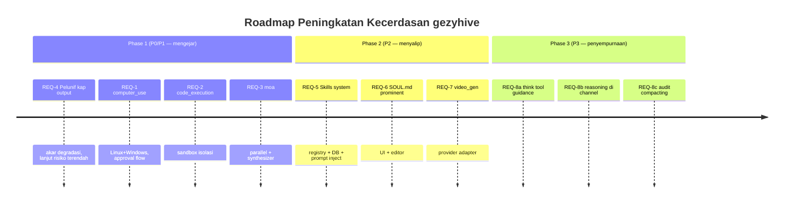

# PRD: Peningkatan Kecerdasan Hivekeep (`gezyhive`) agar Menyalip `gezyhd`

> **Tipe:** Product Requirements Document
> **Sumber:** `audit-kecerdasan-gezyhive.md` (audit read-only, model dikontrol)
> **Status:** Draft — belum ada kode diubah
> **Owner:** TBD

---

## 1. Konteks & Masalah

### 1.1 Latar belakang
`gezyhive` (Hivekeep) adalah platform AI agent self-hosted dengan arsitektur canggih: memori RAG hybrid, prompt caching split stable/volatile, 25+ tool family, 6 channel adapter, sub-agents + inter-agent + crons. `gezyhd` (Hermes Agent Desktop) adalah pembungkus (wrapper) Electron untuk backend Python `hermes-agent` (NousResearch).

Pengguna melaporkan **bot `gezyhd` terasa jauh lebih cerdas** — padahal kedua sistem dijalankan dengan **provider dan model yang sama persis**. Karena variabel model dikontrol, kesenjangan murni berasal dari engineering: **kemampuan bertindak, pengelolaan konteks, dan orchestration multi-model**.

### 1.2 Masalah inti (akar penyebab, dari audit)
| # | Akar penyebab | Bukti |
|---|---|---|
| M1 | Kapabilitas bertindak nyata hilang: `computer_use` (kontrol GUI desktop), `code_execution` (sandbox), `moa` (Mixture of Agents) | grep `gezyhive/src` → `No matches` untuk ketiganya |
| M2 | Pemangkasan output agresif menyebabkan kehilangan konteks pada tugas panjang | `config.ts:308-338` — `toolResultSizeCapTokens=30000`, `toolCallArgsSizeCapTokens=8000`, dst., **selalu aktif**; output besar → placeholder |
| M3 | Tidak ada Skills system (paket instruksi siap install) | `gezyhd/src/main/skills.ts` punya; `gezyhive` hanya project-knowledge |
| M4 | Persona tidak prominent dalam pengalaman user | `gezyhd` punya `SOUL.md` (satu file, prominent); `gezyhive` pakai `agent.character` (terkubur di pengaturan) |
| M5 | (Diferensial produk) `video_gen` tidak ada | `gezyhd` punya toolset `video_gen`; `gezyhive` tidak |

### 1.3 Mengapa penting sekarang
- Kecerdasan yang dirasakan user didominasi **kemampuan bertindak + ketelitian konteks**, bukan model. Menaikkan model tidak akan menutup gap.
- Fondasi teknis sebagian besar sudah ada (`playwright`, `bun-pty`, multi-provider registry, `mini-app-backend`) → investasi relatif efisien.
- Tanpa `computer_use`, Hivekeep hanya "berbicara" alih-alih "bekerja" — membatasi kasus penggunaan real-world (otomatisasi desktop, debugging GUI, scraping interaktif).

---

## 2. Tujuan & Non-Tujuan

### 2.1 Tujuan (Goals)
1. **G1 — Mampu bertindak nyata:** Agent dapat mengoperasikan desktop user (mouse/keyboard/screenshot) dan menjalankan kode terisolasi.
2. **G2 — Konteks tahan lama:** Pada tugas panjang, output tool penting tidak hilang menjadi placeholder yang tidak informatif.
3. **G3 — Orkestrasi multi-model:** Agent dapat menggabungkan beberapa panggilan model untuk konsensus/komparasi (moa).
4. **G4 — Persona prominent:** User dapat melihat & mengedit persona inti agent dengan mudah (SOUL.md).
5. **G5 — Ekstensibilitas keahlian:** Paket instruksi siap pakai (skills) dapat dipasang tanpa coding.
6. **G6 — Menyalip `gezyhd`:** setelah implementasi, pada tugas benchmark dengan model sama, `gezyhive` setara atau lebih unggul dalam metrik keberhasilan & langkah.

### 2.2 Non-Tujuan (Non-Goals)
- ❌ Mengganti atau memodifikasi backend Python `hermes-agent` (di luar cakupan repo ini).
- ❌ Mengubah model/LLM yang digunakan (variabel model tetap sama untuk perbandingan adil).
- ❌ Meregresi keunggulan eksisting `gezyhive` (RAG hybrid, prompt caching, pre-narration guard, 6 channel, sub-agents).
- ❌ Membangun UI/@client besar di luar yang minim diperlukan untuk fitur ini (fokus backend + tool).
- ❌ Multi-platform sempurna untuk `computer_use` di Phase 1 (Linux/Windows/macOS — lihat phasing).

---

## 3. Stakeholder & Persona

| Persona | Kebutuhan dari PRD ini |
|---|---|
| **End user (self-hoster)** | Agent terasa lebih mampu: bisa mengoperasikan mesin, tidak "lupa" di tugas panjang, jawaban gabungan multi-model lebih tajam. |
| **Power user** | Dapat memasang skill pack, atur persona SOUL.md, konfigurasi moa budget & computer_use permission. |
| **Developer/A contributor** | Antarmuka tool yang konsisen (registri `register.ts`), docs arsitektur (`prompt-system.md`, `config.md`) terbarui, test coverage. |
| **Ops/admin** | Kontrol keamanan untuk kapabilitas destruktif (`computer_use`, `code_execution`), default disabled, approval flow. |

---

## 4. User Stories

Sebagai **pengguna Hivekeep**, saya ingin:

- **US-1 (computer_use):** Agent dapat mengambil screenshot layar saya, melihat aplikasi yang terbuka, lalu mengklik/menekan tombol untuk menyelesaikan tugas GUI yang saya minta — dengan persetujuan saya sebelum aksi destruktif.
- **US-2 (code_execution):** Agent dapat menjalankan cuplikan kode (Python/JS/shell) di sandbox terisolasi untuk memverifikasi logika, menghitung data, atau memproses file — tanpa membahayakan sistem saya.
- **US-3 (moa):** Saat saya mengajukan pertanyaan sulit, Agent dapat memanggil beberapa model secara paralel dan menyajikan jawaban gabungan/komparatif yang lebih andal.
- **US-4 (konteks tahan lama):** Saat tugas membentang belasan langkah dengan output tool besar, Agent tetap "ingat" detail penting dan tidak mengulang atau menebak ulang.
- **US-5 (skills):** Saya dapat memasang paket keahlian (mis. "code-reviewer", "excel-wizard") dari registry sehingga Agent langsung mengikuti prosedur terbaik tanpa saya melatihnya.
- **US-6 (SOUL.md):** Saya dapat melihat & mengedit persona inti Agent dalam satu file prominent, dan Agent mengikutinya konsisten.

---

## 5. Requirements Detail (per fitur)

> Format: **Problem → Requirement → Acceptance Criteria → Out of scope → Dependency/Risk → File ref.**
> Setiap fitur punya ID `REQ-X`.

---

### REQ-1 — `computer_use` (kontrol desktop penuh)
*(Priority: P0, Phase 1)*

**Problem:** Agent tidak bisa mengoperasikan GUI user → hanya "berbicara". `gezyhd` punya `computer_use`, `gezyhive` tidak (M1).

**Requirement:** Tool family `computer-use` dengan capability: `screenshot()`, `mouse_click(x,y)/mouse_move/mouse_drag`, `keyboard_type(text)/key_press(combo)`, `scroll`, `get_active_window`/`focus_window`/`list_windows`. Output screenshot dikembalikan sebagai `image` content block ke LLM (model vision).

**Acceptance Criteria (AC):**
- AC-1.1 Tool terdaftar di `register.ts` family `computer-use`, **default disabled**, `destructive: true` untuk tool yang mengubah state.
- AC-1.2 Screenshot dikembalikan sebagai block image yang dapat dikonsumsi model vision (format sesuai `LLMProvider`).
- AC-1.3 Approval flow: tool destruktif (`mouse_click`, `keyboard_type`) memerlukan persetujuan user (hook ke sistem human-in-loop / `prompt_human`) bila policy `requireApproval` aktif; dry-run mode menampilkan screenshot-preview sebelum aksi.
- AC-1.4 Cross-platform minimum: Linux (xdotool/wtype/scrot/grim), Windows (PowerShell/nircmd), macOS (screencapture/cliclick). Phase 1: Linux + Windows.
- AC-1.5 Timeout & abort per panggilan; tidak ada state bocor antar-agent.
- AC-1.6 Test unit untuk parsing koordinat & argumen; e2e minimal happy-path screenshot+click.

**Out of scope:** Cloud/desktop-streaming jarak jauh; multi-monitor advance Phase 1; perekaman video berkelanjutan.

**Dependency/Risk:** 🔴 Tinggi — aksi destruktif. **Mitigasi:** default disabled, opt-in via toolbox, `destructive: true`, approval flow (mirip `gatewayPrompt.ts`-nya `gezyhd`). Linux dependency opsional perlu dokumentasi install.

**File ref:** `src/server/tools/computer-use-tools.ts` (baru), `register.ts`, `src/server/services/playwright-manager.ts` (reuse pola), toolbox config.

---

### REQ-2 — `code_execution` (sandbox eksekusi kode)
*(Priority: P1, Phase 1)*

**Problem:** Model "berpikir via kode" untuk logika/data, tapi tidak ada sandbox terisolasi. `run_shell` ada tanpa isolasi terstruktur (M1).

**Requirement:** Tool `run_code(language, code, stdin?)` dengan isolasi, timeout, capture stdout/stderr/exit code terstruktur. Bahasa awal: Python, JavaScript (Bun), shell. Isolasi minimal: process resource limits (CPU/mem/time), scope filesystem terbatas.

**Acceptance Criteria:**
- AC-2.1 Family `code-execution` terdaftar di `register.ts`; default disabled di toolbox bawaan, opt-in.
- AC-2.2 Output terstruktur `{ stdout, stderr, exitCode, durationMs, truncated }`.
- AC-2.3 Timeout wajib (default 30s, max env `GEZY_CODE_EXEC_MAX_TIMEOUT`); abort bersih (kill child).
- AC-2.4 Isolasi: working dir ephemeral (temp), tidak menulis di luar scope, env terkontrol (whitelist secret via vault eksplisit).
- AC-2.5 Cap output (head+tail + indikator truncation) — selaras dengan REQ-4.
- AC-2.6 Test: eksekusi normal, timeout, crash, stdin, output besar.

**Out of scope:** Docker/isolasi kernel penuh Phase 1 (sandi process-limit cukup untuk self-hosted); bahasa non-natif Phase 2.

**Dependency/Risk:** 🟡 Sedang — keamanan. **Mitigasi:** adopsi permission model `mini-app-backend.ts`; jangan share workspace tanpa scope.

**File ref:** `src/server/tools/code-exec-tools.ts` (baru), `register.ts`, `mini-app-backend.ts` (pola isolasi/permission), `bun-pty`.

---

### REQ-3 — `moa` (Mixture of Agents)
*(Priority: P1, Phase 1)*

**Problem:** Tidak ada orchestrasi multi-model. `gezyhd` punya `moa` ("Coordinate multiple AI models together"). Ensemble meningkatkan keandalan bahkan dengan model sama (M1).

**Requirement:** Tool `moa(prompt, models?[], strategy?, budget?)` — memanggil N model via `LLMProvider.chat()` paralel (default: model sesi aktif dengan temperatur/prompt variasi; atau daftar model eksplisit), lalu pass synthesizer (model "judge/synthesizer") menggabungkan menjadi jawaban final. Strategi: `parallel` (gabung), `debate` (round kritis), `vote` (mayoritas).

**Acceptance Criteria:**
- AC-3.1 Family `moa` di `register.ts`; default enabled untuk toolbox admin, opt-in untuk agent umum.
- AC-3.2 Kontrol budget: `maxModels` (default 3), batas token/turn; cost terlihat di tool result.
- AC-3.3 Pemilihan model: default = model sesi aktif ×N dengan temp/prompt variasi; dukung array `[modelId]` eksplisit.
- AC-3.4 Output: jawaban final + ringkasan bagian dari tiap model (trace untuk transparansi).
- AC-3.5 Abort & timeout menyeluruh; paralel via `Promise.allSettled`.
- AC-3.6 Test: paralel 3 model, model gagal diabaikan + fallback, budget terlampaui → error deskriptif.

**Out of scope:** `debate` multi-round penuh Phase 2; routing otomatis model-by-prompt-complexity Phase 2.

**Dependency/Risk:** 🟡 Sedang — cost token (N+1×). **Mitigasi:** budget control + synthesizer pakai model murah bila dipilih; dokumentasi cost.

**File ref:** `src/server/tools/moa-tools.ts` (baru), `register.ts`, `src/server/llm/llm/*` (panggilan `chat()`), `provider-registry.ts`.

---

### REQ-4 — Pelunakan Cap Output (anti kehilangan konteks)
*(Priority: P0, Phase 1)*

*(M2) Satu-satunya yang langsung mengubah jalan kode eksisting — hati-hati.*

**Problem:** `toolResultSizeCapTokens=30000` dst. (selalu aktif) menjadikan output besar jadi placeholder → agent kehilangan konteks konkret pada tugas panjang.

**Requirement:** Ganti strategi placeholder generik pada output besar dengan **ringkasan kontekstual** (head + tail + struktur bentuk kunci), disertai indikator truncation yang sengaja diekspos ke reasoning agent. Cap adaptif berdasarkan context window model besar. Pertahankan cache-safety (kriteria trim stabil per-message).

**Acceptance Criteria:**
- AC-4.1 Output > cap → payload LLM berisi **head + tail + placeholder kontekstual** (mis. `…[truncated {lines} lines of {kind}]​`) BUKAN ringkasan kosong; `summarizeToolResultValue` diperbaiki untuk mempertahankan landmark (mis. nama fungsi path file untuk `read_file`, error lines untuk `run_shell`).
- AC-4.2 Indikator truncation dimasukkan sebagai baris eksplisit agar agent tahu konteks dipangkas (agent dapat memanggil tool baca file spesifik untuk memperdalam).
- AC-4.3 Cap adaptif: kap `effective = min(percent × contextWindow, absoluteCap)`; pada model window besar (1M), absolute cap dinaikkan atau percent mengambil alih; behavior dikorporasikan via `recordApiContextSize`/kalibrasi yang sudah ada.
- AC-4.4 **Cache-safety dipertahankan**: kriteria trim stabil per-message (tidak mengubah prefix byte-for-byte di tengah sesi yang sama). Test memverifikasi determinisme payload untuk pesan yang sama.
- AC-4.5 Toggle via env (`TOOL_RESULT_SIZE_CAP_TOKENS=0` = disable) tetap berfungsi; default dinaikkan ke nilai baru (mis. 60000) dengan dokumentasi trade-off.
- AC-4.6 Benchmark: tugas coding panjang standar, model sama — hitung langkah & keberhasilan sebelum/sesudah; target peningkatan keberhasilan + penurunan langkah repetisi.

**Out of scope:** Semantic chunking/recall on-demand Phase 2 (tool "expand truncated" opsional Phase 2); prompt-caching rewriting.

**Dependency/Risk:** 🟡 Sedang — cost token naik. **Mitigasi:** tunable; tidak boleh invalidasi cache Anthropic. ⚠️ Risiko regresi: pre-narration guard & compacting tetap utuh.

**File ref:** `src/server/config.ts:308-338`, `src/server/services/agent-engine.ts:700-913` (`truncateToolResultValue`, `summarizeToolResultValue`, `maskOldToolResults`), `src/server/services/tool-output-spill.ts`.

---

### REQ-5 — Skills System (paket instruksi `SKILL.md`)
*(Priority: P2, Phase 2)*

**Problem:** Tidak ada paket instruksi siap install; hanya `project-knowledge` + custom tools (M3).

**Requirement:** Konsep **skill pack** = `SKILL.md` (instruksi/prosedur terstruktur) + preconfigured tool bundle opsional. Install dari registry (built-in + remote URL). Saat aktif & terpicu relevan, instruksi disuntik ke prompt sebagai block volatile baru.

**Acceptance Criteria:**
- AC-5.1 Entity DB: tabel `skills` (id, name, category, description, source, installed_at, enabled); migrasi via `drizzle-kit generate`.
- AC-5.2 API: `GET/POST/DELETE /api/skills` install/uninstall/list/detail; SSE event `skills:changed`.
- AC-5.3 Saat enabled, block prompt baru `## Active skill: {name}` disuntik (volatile) via `prompt-builder.ts`; instruksi dapat dipolong ke `# Skill` section.
- AC-5.4 Relevansi trigger: filter by tag/keyword ke incoming message (reuse pola memory retrieval). Minimal: manual enable per-agent Phase; per-prompt auto-relevansi Phase 2 follow-up.
- AC-5.5 Built-in registry seed (mis. 3 contoh skill: code-reviewer, git-committer, sql-analyst) sebagai `SKILL.md` asset.
- AC-5.6 Permission: skill dapat mengaktifkan tool pada toolbox; user menyetujui tool yang diminta saat install.

**Out of scope:** Marketplace publik Phase 2; signed/sandboxed skill execution Phase 3.

**Dependency/Risk:** 🟢 Rendah-Sedang. Pastikan tidak membahayakan cache (block volatile, tidak di stable prefix).

**File ref:** `src/server/services/skills.ts` (baru), `src/server/tools/skill-tools.ts`, `prompt-builder.ts`, `src/server/db/schema*`.

---

### REQ-6 — SOUL.md prominent (persona prominent)
*(Priority: P2, Phase 2)*

**Problem:** Persona agent tidak prominent; `gezyhd` punya `SOUL.md` (M4).

**Requirement:** Persona inti agent (`agent.character`) diekspos sebagai **satu file prominent editable** "SOUL" di UI, dengan default template reasoning-friendly. Prompt-builder memakai isi SOUL pada block "Personality".

**Acceptance Criteria:**
- AC-6.1 UI: halaman/komponen prominent "SOUL" per agent dengan editor (CodeMirror sudah ada), preview, reset-to-default.
- AC-6.2 Default template: `You are {name}... you think step-by-step and explain your reasoning...` (mirip `gezyhd/src/main/soul.ts`).
- AC-6.3 Persistensi: field `agent.character`/ekuivalen; backward-compat dengan data lama (fallback).
- AC-6.4 Prompt-builder block Personality memakai SOUL (uli/untuk agent yang belum set, gunakan default).
- AC-6.5 i18n labels; UI konsisten di mobile.

**Out of scope:** Multi-persona dynamic persona-switching Phase 3.

**Dependency/Risk:** 🟢 Rendah.

**File ref:** `prompt-builder.ts` block 5, `src/client/components/agent/` (UI baru), `src/server/tools/agent-management-tools.ts`.

---

### REQ-7 — `video_gen`
*(Priority: P2, Phase 2)*

**Problem:** Diferensial produk — `gezyhd` punya, `gezyhive` tidak (M5).

**Requirement:** Tool `generate_video(prompt, model?, duration?, aspect_ratio?)`, `list_video_models`; provider adapter (Runway/Veo/Kling dst.) di bawah primitive `video` paralel dengan `src/server/llm/image/`.

**Acceptance Criteria:**
- AC-7.1 Family `images` (atau `video` baru) terdaftar; tool `generate_video` mengembalikan URL/attachment yang dapat di-attach ke channel/preview.
- AC-7.2 `list_video_models` mengambil dari provider API (tidak hardcode model id) —selaras konvensi `prompt-system.md` §Adding provider).
- AC-7.3 Test provider adapter (mock); test klasifikasi metadata.
- AC-7.4 Dokumentasi provider (docs-site) diperbarui.

**Out of scope:** Editor video/trimming; transcript auto-sync Phase 3.

**Dependency/Risk:** 🟡 Sedang — API eksternal & cost. **Mitigasi:** tunable, opt-in.

**File ref:** `src/server/llm/video/` (baru), `src/server/tools/image-tools.ts`+`video-tools.ts`, `provider-registry.ts`.

---

### REQ-8 — Penyempurnaan Reasoning/Prompt (Tier 3)
*(Priority: P3, Phase 3)*

Tiga penyempurnaan ringan:

**8a — Dorong `think` tool** | `think-tool.ts` sudah ada (port Claude Code). Tambah instruksi di `## Tool calling discipline` (`prompt-builder.ts` block 4): "for hard problems, call `think` first." Test: prompt benchmark sulit → frekuensi `think` meningkat, langkah repetisi turun.

**8b — Reasoning di channel** | `thinking-delta` sudah di-handle (`stream-runner.ts`); pastikan adapter channel (`telegram.ts`, `discord.ts`, dst.) bisa render reasoning sebagai collapsed/spoiler → transparansi = terasa lebih cerdas. AC: Telegram render reasoning via spoiler/quote; Discord via thread/bloot. Tidak mengirim raw reasoning tanpa toggle.

**8c — Audit compacting** | Validasi `thresholdPercent=75`/`keepPercent=25` tidak menumpuk kehilangan fakta penting pada tugas multi-hari. Benchmark model sama: keberhasilan task + retensi observasi kritis. Tunable via `COMPACTING_*` jika perlu.

**File ref:** `prompt-builder.ts`, `src/server/channels/*`, `compacting.ts`.

---

## 6. Metrik Sukses & Benchmark

### 6.1 Metrik produk
| Metrik | Definisi | Target |
|---|---|---|
| Task success rate | % tugas benchmark terselesaikan benar | ≥ `gezyhd` pada tugas yang sama/model sama |
| Step efficiency | rata-rata langkah agent per tugas | ≤ `gezyhd` (tidak repetisi) |
| Context retention | % observasi kritis dari N turns sebelumnya yang masih diakses benar di turn N+k | ≥ `gezyhd` |
| Time-to-first-actionable | detik hingga agent mengambil aksi nyata pertama (si `gezyhd` punya computer_use, `gezyhive` nantinya) | kompetitif |
| Token cost per task | total token untuk task std | `gezyhive` boleh lebih tinggi untuk moa; tetap dalam budget yang dikonfigurasi |
| Regression rate | % suite test eksisting yang gagal | 0 |

### 6.2 Benchmark protokol (model sama, controlled)
- **B1 — Tugas coding panjang:** debug repo multi-file, fix, verifikasi. Bandingkan `gezyhive` (baseline) vs `gezyhive` (+REQ-4) vs `gezyhd`. Hitung success/step/retention.
- **B2 — Tugas GUI real-world:** isi form web app /otomatis klik. `gezyhive` (+REQ-1) vs `gezyhd`. Hitung success.
- **B3 — Pertanyaan reasoning sulit:** moa ON vs OFF di `gezyhive`; bandingkan vs `gezyhd` single. Hitung quality (human rubric) + cost.
- **B4 — Tugas multi-hari retention:** pulihkan observasi lama setelah compacting. `gezyhive` (+audit compacting) vs `gezyhd`.

### 6.3 Sinyal kualitatif
- User survey: "mana yang terasa lebih cerdas" A/B blind (model sama).
- Latensi tugas panjang tidak memburuk akibat +computer_use (perceptual).

---

## 7. Phasing & Roadmap

**Dependencies antar-fase:**
- REQ-4 **wajib pertama** — validasi hipotesis degradasi M2 dengan model sama sebelum menambah kapabilitas (evaluasi cepat: coba `TOOL_RESULT_SIZE_CAP_TOKENS=0` lalu benchmark B1).
- REQ-1, REQ-2, REQ-3 dapat paralel (write-set disjoint: 3 file tool baru + `register.ts`).
- REQ-5 butuh skema DB baru (migrasi) — sikron dengan `tools/*` yang sudah ada.
- REQ-6 UI butuh `agent-management` API — lanjutan saja.

**Urutan rekomendasi (parallelizable blocks):**
1. **Validasi cepat** REQ-4 (env disable cap, benchmark B1) — konfirmasi hipotesis.
2. **Phase 1 sprint:** REQ-4 (fix) ‖ REQ-3 (moa) ‖ REQ-2 (code_execution) → REQ-1 (computer_use) terakhir (paling risky).
3. Benchmark B1+B3 setelah Phase 1.
4. **Phase 2** paralel REQ-5 ‖ REQ-6 ‖ REQ-7.
5. **Phase 3** fine-tuning/penyempurnaan.

---

## 8. Risiko & Mitigasi (konsolidasi)

| Risiko | Severity | Mitigasi |
|---|---|---|
| `computer_use` aksi destruktif (hapus file/klik salah) | 🔴 Tinggi | Default disabled; `destructive: true`; approval flow; dry-run + screenshot preview; audit log |
| `code_execution` eksekusi kode berbahaya | 🟡 Sedang | Isolasi process-limit; scope filesystem; env whitelist; adapt `mini-app-backend.ts` permission |
| `moa` cost token (N+1×) | 🟡 Sedang | Budget control `maxModels`; synthesizer model murah; dokumentasi cost default |
| Cap change invalidasi prompt cache Anthropic | 🔴 Tinggi | Kriteria trim stabil per-message; test determinisme; pelihara `progressiveCompaction=false` default |
| Regresi keunggulan `gezyhive` (RAG/caching/guard) | 🔴 Tinggi | Test suite eksisting 0 regresi; review `sse.md` sebelum SSE; review `prompt-system.md` sebelum prompt |
| Multi-platform `computer_use` tidak merata | 🟡 Sedang | Phase 1 Linux+Windows; macOS Phase 2; dokumentasi dependency opsional |
| Backend Python `gezyhd` tidak bisa diverifikasi | 🟢 Rendah | Klaim reasoning loop bersifat inferensi; tidak meng-copy langsung |

---

## 9. Open Questions

1. **`computer_use` permission model:** apakah pakai human-in-loop sistem `prompt_human` eksisting, atau butuh approval modal UI baru (mirip `gatewayPrompt.ts`-nya `gezyhd`)?
2. **moa default:** apakah synthesizer wajib model kuat (Claude Sonnet) atau boleh model sesi? Trade-off cost vs kualitas.
3. **Cap output:** nilai default baru (60000? adaptif?) — perlu benchmark untuk range optimal per context window.
4. **Skills:** apakah instrukssi skill tidak boleh langsung memicu tool kita (sekedar prompt), atau dapat "mendaftarkan" tool pada toolbox? Inflasi permukaan tool yang diberikan ke LLM (cap `maxTools`).
5. **video_gen:** provider mana yang di-prioritize? (Runway/Veo/Kling) — konfirmasi kebutuhan user.
6. **SOUL.md:** satu persona per agent atau global? Apakah menggantikan `agent.character` atau field baru?
7. **Phasing:** apakah `computer_use` wajib Phase 1, atau bisa tertukar ke Phase 2 bila effort meledak?

---

## 10. Out of Scope (eksplisit)

- Membangun ulang agent-engine (cukup integrasi tool).
- Mengganti stack LLM/SDK.
- Kompatibilitas perfect dengan backend `hermes-agent`.
- Mobile app native (web UI responsif cukup).
- Marketplace skill publik / signature verification (Phase 3+).

---

## 11. Deliverable per fase

| Fase | Deliverable | Acceptance utama |
|---|---|---|
| 1 | `computer-use-tools.ts`, `code-exec-tools.ts`, `moa-tools.ts` + `register.ts` + env config cap; test; docs | Benchmark B1/B2/B3 competitiveness; test 0 regresi |
| 2 | `skills.ts` + skema migrasi; UI SOUL editor; `llm/video/*` provider adapter | Test skill injection; SOUL editor flows; docs-site updated |
| 3 | Prompt patch; channel reasoning render; compacting tuning report | Benchmark B4; qualitative survey; latency no regression |

---

## 12. Lampiran

- Audit asli: `audit-kecerdasan-gezyhive.md` (sumber temuan M1–M5).
- Referensi kode: §7 audit (daftar path file kunci kedua proyek).
- Dok arsitektur wajib baca sebelum area terkait: `prompt-system.md`, `config.md`, `sse.md`, `compacting.md`, `api.md`.

---

*PRD ini dibuat dari audit read-only. Implementasi terpisah dengan commit bertahap, `bun run typecheck && bun run test` sebelum merge.*