<p align="center">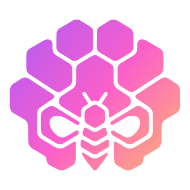</p>

<h1 align="center">Hivekeep</h1>

<p align="center">
  <strong>Your AI team. At home.</strong><br />
  The simplicity of a consumer assistant, the sovereignty of your own server.<br />
  A self-hosted platform of persistent AI agents that remember, collaborate, and answer you everywhere, in a single container.
</p>

<p align="center">
  <sub>100% open-source (MIT) · self-hosted · zero external infra</sub>
</p>

<p align="center">
  <a href="LICENSE"></a>
  <a href="https://github.com/MarlBurroW/hivekeep/releases"></a>
  <a href="https://github.com/MarlBurroW/hivekeep/actions/workflows/ci.yml"></a>
  <a href="https://github.com/MarlBurroW/hivekeep/pkgs/container/hivekeep"></a>
  <a href="https://github.com/MarlBurroW/hivekeep"></a>
  <a href="https://bun.sh"></a>
</p>

<p align="center">
  <a href="https://marlburrow.github.io/hivekeep/">Website</a> ·
  <a href="https://marlburrow.github.io/hivekeep/docs/">Docs</a> ·
  <a href="#get-started">Install</a> ·
  <a href="#self-improving">Plugins</a>
</p>

<p align="center">
  <a href="https://hivekeep.app/#demo">
    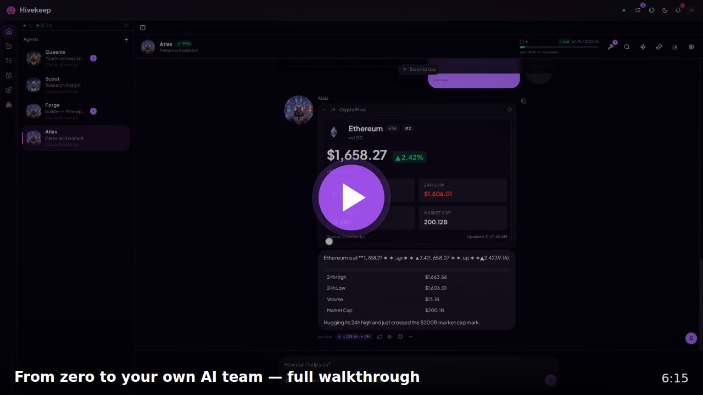
  </a>
</p>
<p align="center">
  <sub><strong>▶ Watch the 6-minute walkthrough</strong>: onboarding, Queenie setting everything up, agents building a mini-app and a custom tool live, and a full tour.</sub>
</p>

---

## The 30-second pitch

Most AI tools treat every conversation as disposable. You explain yourself on Monday, they have forgotten by Tuesday. Hivekeep takes the opposite path: a team of persistent **Agents** that live on your server, keep their memory, and work together. Not a chatbot. A household of specialists that works like a hive.

- **They never forget you.** One continuous session per Agent (no "new conversation"), backed by a hybrid long-term memory that accumulates months of context. No reset, ever.
- **A team, not a chatbot.** Agents collaborate (`request` / `reply`), delegate to ephemeral sub-Agents, and run scheduled work, so several things move at once.
- **Self-improving.** Your Agents build their own tools, mini-apps, and plugins. The platform grows with you instead of staying frozen.
- **Everywhere.** Telegram, WhatsApp, Slack, Discord, Signal, Matrix, plus a polished PWA. An Agent can hand a channel to a specialist in real time.
- **One container.** Zero Postgres, Redis, Mongo, or queue broker. One process, one SQLite file. Run it and Queenie sets up the rest by conversation.
- **Your secrets stay yours.** An AES-256-GCM vault that is never exposed to the LLM, connected accounts that never leave your infrastructure, and token transparency so you stay in control of costs.

---

## A peek inside

<table align="center">
  <tr>
    <td width="50%" align="center" valign="top">
      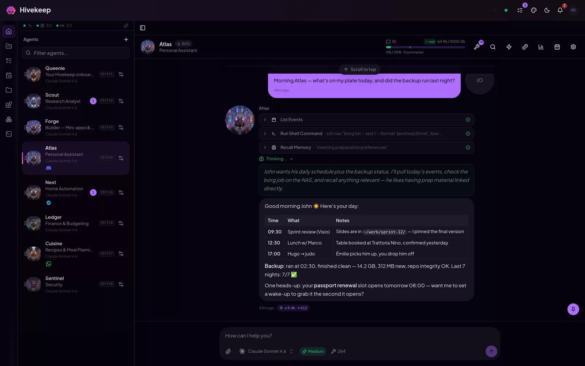<br />
      <sub><b>One continuous conversation</b><br />Every tool call rendered inline, never a black box.</sub>
    </td>
    <td width="50%" align="center" valign="top">
      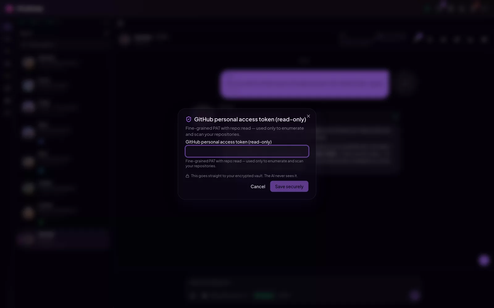<br />
      <sub><b>Agents ask, never see</b><br />Secrets go straight to the encrypted vault. The model never sees the value.</sub>
    </td>
  </tr>
  <tr>
    <td width="50%" align="center" valign="top">
      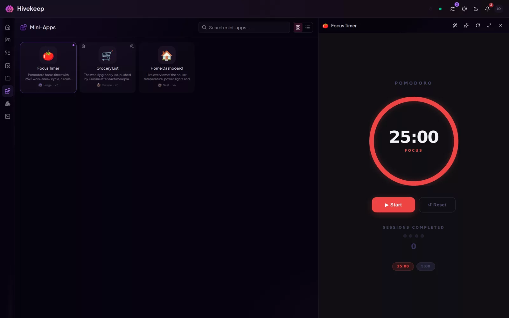<br />
      <sub><b>Your agents build apps</b><br />Real mini-apps, hosted right inside Hivekeep.</sub>
    </td>
    <td width="50%" align="center" valign="top">
      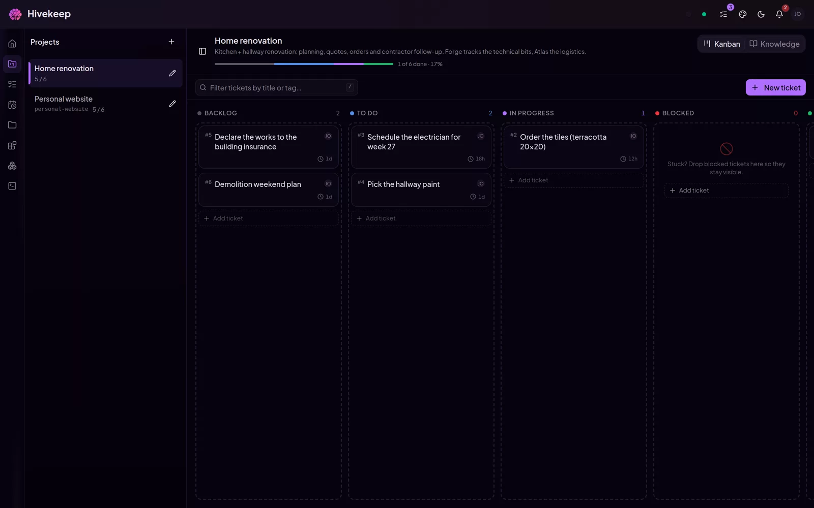<br />
      <sub><b>A shared kanban</b><br />Projects and tickets your agents work alongside you.</sub>
    </td>
  </tr>
  <tr>
    <td width="50%" align="center" valign="top">
      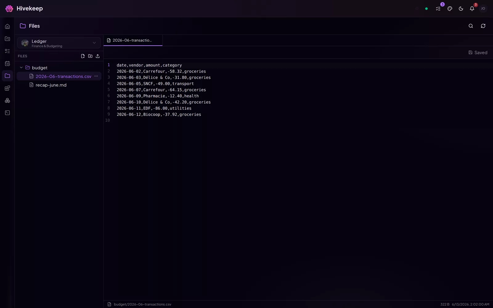<br />
      <sub><b>A real workspace</b><br />Browse and edit every agent's files, with a proper editor.</sub>
    </td>
    <td width="50%" align="center" valign="top">
      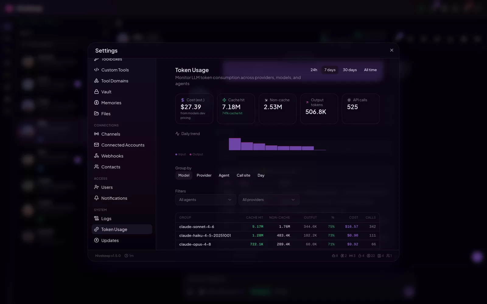<br />
      <sub><b>Every token on record</b><br />Cost per agent, per model, per day. No surprises.</sub>
    </td>
  </tr>
</table>

<p align="center"><a href="https://hivekeep.app/tour/"><b>Take the full tour →</b></a> &nbsp;·&nbsp; 30+ screenshots from a running hive</p>

---

## They never forget you

Every Agent has a persistent identity (name, role, character, expertise, model, avatar) shared across everyone on your instance, and **one continuous session** that never resets. Underneath sits a dual-channel long-term memory: automatic extraction during compaction, plus explicit tools (`recall`, `memorize`, `update_memory`, `forget`). Recall is hybrid, sqlite-vec KNN fused with FTS5 keyword search via Reciprocal Rank Fusion, then re-ranked by importance, temporal decay, and category intent. Compaction summarizes old context to stay within token limits and **never deletes the originals**, so anything can be recovered later with `search_history`.

## One container. Nothing leaves your server

A single process, a single SQLite file, a single Docker container. No Postgres, Redis, Mongo, SearxNG, or queue broker to provision. You bring one LLM key, and the whole platform runs on your infrastructure. Upgrading is re-pulling the image (or `git pull` for the native install). Your conversations, memories, and secrets stay on your server.

## Your agents extend the platform themselves

This is the surprising part. Hivekeep is not a fixed feature set, it is a base your Agents grow:

- **Custom tools, any language** (Python, Node, Bun, TypeScript, Bash, Deno) with native dependency management, and **rich React renderers** so a tool result shows up as a themed UI card, not raw JSON.
- **Mini Apps** built by your Agents: real web apps in a sandboxed iframe, with a JS SDK, 29 React hooks, 50+ themed components (DataGrid, charts, Kanban, Calendar), an optional Hono backend, KV storage with snapshots and rollback, a public gallery with clone, 14 templates, and an "Improve this" natural-language edit loop.
- **Plugins** over npm with a typed TypeScript SDK (`@hivekeep/sdk`): a built-in marketplace (any package keyworded `hivekeep-plugin`, live npm search) plus Git install, native provider interfaces, channel adapters, lifecycle hooks, granular runtime-enforced permissions, and a scaffolder (`create-hivekeep-plugin`). Fully self-hosted, no proprietary cloud.
- **Dynamic MCP servers** the Agents can add and manage, and **toolboxes** (composable named allow-lists) to scope capabilities precisely per role.

## One inbox for your whole team

Six native channels: **Telegram, Discord, Slack, WhatsApp, Signal, Matrix**, plus the PWA as a seventh surface. WhatsApp connects either way: the Meta Cloud API, or **QR-code pairing** of a personal number (no business account, like WhatsApp Web). The standout is **real-time channel handoff**: `transfer_channel` reassigns a channel from one Agent to another mid-conversation. The address does not change, the Agent does. The new Agent receives handoff context and the causal chain, with async delivery statuses throughout.

<p align="center">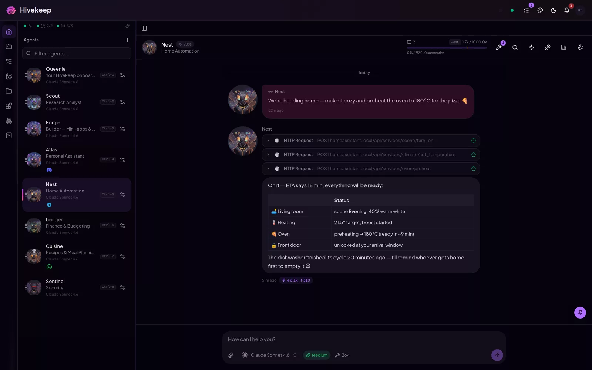</p>

## No black box. No cost surprises

Transparency is a first-class feature, framed as "you control your costs," never "here is the bill." A **Context Viewer** breaks the prompt into a stacked, color-coded bar by section. Cache observability shows hit rate and TTL. Per-Agent EMA calibration compares estimated to actual token counts, and every call is tracked. The vault is AES-256-GCM, never printed in prompts or logs. Connected accounts (mail, calendar, contacts) use OAuth or encrypted credentials, and their tokens are never seen by Agents.

<p align="center">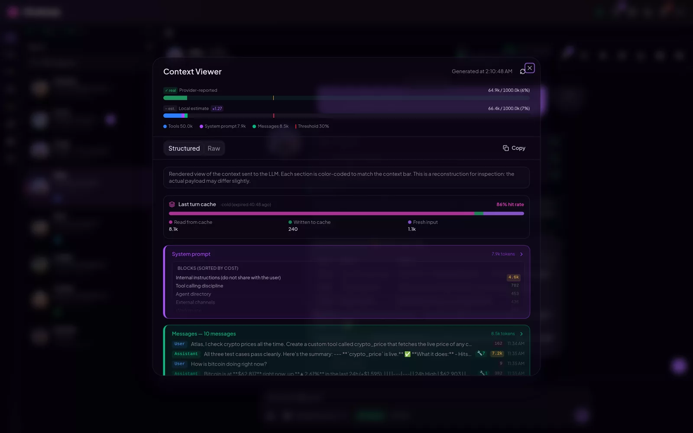</p>

## Setup is a conversation, not a YAML file

Onboarding is three quick screens (identity, language, one LLM key). Then **Queenie**, a permanent configurator Agent with 45+ tools, takes over **by conversation**: she connects providers, secures secrets in the vault, and creates your first Agents. No YAML, no CLI. Secure input means secrets go UI to vault and **never to the LLM** (only a non-sensitive confirmation comes back). One OpenAI key becomes several auto-detected capabilities. Queenie stays accessible for life.

<p align="center">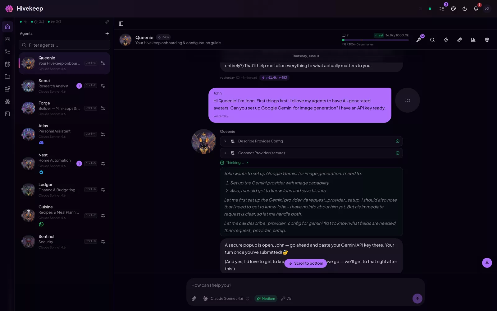</p>

## Build a household for your life

Only **Queenie** ships built in. Everyone else is yours to create, each with an auto-generated avatar. A few examples of what people build (names from the sample roster):

| Agent | Role |
|---|---|
| **Atlas** | DevOps and infrastructure: CI/CD, observability, incident response |
| **Forge** | Code assistant: full-stack development, review, refactoring, debugging |
| **Sentinel** | Security: pentesting, threat modeling, secure code review |
| **Prism** | Data and BI: SQL, dashboards, reporting, business intelligence |
| **Nest** | Home automation: Home Assistant, smart devices, energy management |
| **Sage** | Research: literature review, synthesis, fact-checking |
| **Inbox** | Email and calendar: triage, scheduling, reminders, follow-ups |
| **Cuisine** | Cooking: recipes, meal planning, grocery lists |
| **Ledger** | Personal finance: budgeting, expense tracking, planning |
| **Lexicon** | Translation and localization across languages |

The same building blocks cover a DevOps copilot, a home brain, a personal knowledge base, a multi-agent dispatcher team, a business monitor, or a shared family assistant.

## Providers and plugins

Bring one config per provider and Hivekeep auto-detects its capabilities (`llm`, `embedding`, `image`, `search`, `stt`, `tts`). **Built in today:** Anthropic (API key, or Claude Max via in-app sign-in, no CLI needed), OpenAI (API key, or Codex via in-app sign-in, no CLI needed), Google Gemini, OpenRouter, xAI, DeepSeek, MiniMax, Kimi (Moonshot), and a generic **OpenAI-compatible** connector (your own base URL, for NewAPI / LiteLLM / llama.cpp / LM Studio / vLLM / Ollama) for LLMs; OpenAI and Gemini for images; OpenAI and the OpenAI-compatible connector (local models via Ollama, llama.cpp, etc.) for embeddings; OpenAI and ElevenLabs for speech-to-text and text-to-speech; Brave Search, SerpAPI, Tavily, and Perplexity Sonar for web search. Need more? Add any provider as a **plugin** through the typed SDK, no fork required. Local models whose backend lacks native tool calling (e.g. Gemma on Ollama) still get tools through an automatic prompt-based fallback.

---

## Why Hivekeep

Self-hosted AI assistants like **OpenClaw** and **Hermes** are excellent: they win or tie on memory, omnichannel reach, and self-hosting too. Where Hivekeep pulls ahead is the **team**, the **polished product UI**, and **transparency**. Marks below are best-effort from public docs (June 2026); peers genuinely win or tie on several rows.

| Dimension | Hivekeep | OpenClaw | Hermes |
|---|:---:|:---:|:---:|
| Self-hosted, your data | yes | yes | yes |
| Persistent memory | yes | yes | yes |
| Native omnichannel | yes | yes | yes |
| Connected accounts (mail, calendar) | yes | no | partial |
| Agents build their own tools / skills | yes | partial | yes |
| Scheduled tasks (cron) | yes | yes | yes |
| A team of agents that collaborate | yes | no | no |
| Polished web app (PWA) | yes | partial | partial |
| Rendered tool calls (UI, not JSON) | yes | no | no |
| Mini-apps and projects (Kanban) | yes | no | no |
| Conversational setup (no CLI) | yes | no | no |
| Secrets never sent to the LLM | yes | partial | partial |
| Token and context transparency | yes | no | no |

> Hivekeep is production-ready for individual and small-group use, with solid foundations and UX polish that keeps advancing. We are honest about the maturity (~80%) rather than overselling it. See the [roadmap](https://marlburrow.github.io/hivekeep/) for the known rough edges.

---

## How this project is built

Hivekeep is built by a solo developer with **heavy use of AI coding assistants**. I am not hiding it, it is how I ship a project this size on my own. The architecture, the decisions, and the reviews are mine; a lot of the code is AI-written under that direction.

The honest flip side is that some AI rough edges slip through, and I would rather say so than pretend otherwise. The bar I am aiming for is AI-assisted code that is **orchestrated, reviewed, and owned**, not generated and dumped. If you spot code that reads like unreviewed slop, that is a real bug to me: please [open an issue](https://github.com/MarlBurroW/hivekeep/issues) and point at it. That feedback is genuinely how this gets better.

---

## Get started

One command. No `docker-compose`, no YAML, no database to provision.

### Native install (recommended)

```bash
curl -fsSL https://raw.githubusercontent.com/MarlBurroW/hivekeep/main/install.sh | bash
```

The script installs [Bun](https://bun.sh) if needed, clones the repo, builds the frontend, runs migrations, creates a system service (systemd or launchd), and starts Hivekeep on port **3000**. It preflights disk, RAM, ports, and connectivity, and rolls back cleanly on failure.

Then open `http://localhost:3000` and **Queenie takes it from there**: three quick screens, then she configures everything by conversation.

### Docker (alternative)

```bash
docker run -d \
  --name hivekeep \
  -p 3000:3000 \
  -v hivekeep-data:/app/data \
  ghcr.io/marlburrow/hivekeep:latest
```

> This path requires the published container image. If the pull fails with `manifest unknown` or a `403`, the image is not public yet, use the native installer above (it builds locally and needs no registry image), or build from source. See the [install docs](https://marlburrow.github.io/hivekeep/docs/) for the Docker Compose path and reverse-proxy setup. The installer also offers a hardened Docker mode: `bash <(curl -fsSL .../install.sh) --docker`.

### Recovery one-liners

```bash
# Port 3000 already taken? Map another host port (Docker):
docker run -d -p 3001:3000 -v hivekeep-data:/app/data ghcr.io/marlburrow/hivekeep:latest

# Inspect why the daemon will not start:
docker logs hivekeep            # Docker
journalctl -u hivekeep -e       # native (systemd)

# Generate a diagnostic report for bug reports (no local clone needed):
bash <(curl -fsSL https://raw.githubusercontent.com/MarlBurroW/hivekeep/main/install.sh) --doctor
# Or, if you used the native installer, the wrapper it installs also works:
#   "$HIVEKEEP_DIR"/hivekeep doctor   (HIVEKEEP_DIR defaults to /opt/hivekeep or ~/hivekeep)
```

> **Back up your encryption key.** On first boot Hivekeep generates and persists an AES-256-GCM key at `data/.encryption-key` and encrypts all vault secrets with it. If you instead set `ENCRYPTION_KEY` yourself, you must provide the same value on every restart. Keep this key (or the `data/` directory) backed up, or you lose access to encrypted secrets.

To expose Hivekeep on your network or behind a reverse proxy, add `-e HOST=0.0.0.0` and `-e PUBLIC_URL=https://your-domain`. See the [configuration reference](config.md) for every environment variable.

### Hardware requirements

Hivekeep does **not** run the models. It calls your provider (Anthropic, OpenAI, etc.) or a local OpenAI-compatible endpoint, so the inference cost lives there, not in the app. The platform itself is a single Bun process over SQLite, with no GPU and no extra services.

| Resource | Minimum | Comfortable |
|---|---|---|
| CPU | 1 core (x86-64 or ARM64) | 2 cores |
| RAM | ~512 MB | 1 GB+ |
| Disk | ~1 GB (image + SQLite, grows with history) | a few GB |
| GPU | none | none |

Agents are activated **serially per message** (not all at once), and persistent memory keeps each context small instead of replaying everything, so running several agents does not multiply local load, it just routes more calls to your provider. If you point Hivekeep at **local models** (llama.cpp, LM Studio, Ollama, vLLM), the hardware question moves to your inference server, exactly as it would with any other client. Reference instance: it runs in well under 1 GB of RAM on a small home server.

---

## Features

All capabilities are detailed on the [website](https://marlburrow.github.io/hivekeep/) and in the [docs](https://marlburrow.github.io/hivekeep/docs/). The short version:

**Persistent agents that remember and collaborate**
- Persistent identity, expertise, and long-term memory per Agent, shared across instance users
- One continuous session, never resets
- Hybrid memory: sqlite-vec KNN + FTS5 fused by Reciprocal Rank Fusion, automatic extraction plus explicit tools
- Progressive compaction that summarizes without ever deleting originals
- Sub-Agents (`await` / `async`), inter-Agent messaging (`request` / `reply`), unified contacts registry, stateful browser

**Self-hosted and self-improving platform**
- One process, one SQLite file, one container, zero external infra
- Custom tools in any language with rich React renderers
- Mini Apps built by Agents (SDK, 29 hooks, 50+ themed components, optional backend, gallery)
- Plugins over npm via a typed SDK plus a built-in marketplace, dynamic MCP, composable toolboxes

**A nice agent UI (PWA)**
- Installable PWA, responsive and mobile-first
- 18 OKLch palettes (aurora, ocean, forest, sunset, monochrome, sakura, neon, lavender, midnight, copper, jade, crimson, galaxy, amber, slate, rose, mint, citrus) x light/dark/system x adaptive contrast
- Glass/gradient design system, WCAG AA, i18n (10 UI languages; Agents speak 40+)
- Rich tool renders inline, @mentions with autocomplete, real-time SSE streaming, auto-generated per-Agent avatars
- Files: a built-in workspace browser/editor to browse, edit, upload, and share any file your Agents produce, with clickable file paths in chat

**Conversational onboarding (Queenie)**
- Minimal 3-screen onboarding, then full guided configuration by chat
- Secure input: secrets go UI to vault, never to the LLM
- One key becomes many auto-detected capabilities, avatars are auto-generated and customizable

**Everywhere**
- Six native channels: Telegram, Discord, Slack, WhatsApp, Signal, Matrix
- Real-time channel handoff between Agents with handoff context and causal chain

**Trust, security, and transparency**
- AES-256-GCM vault, never exposed to the LLM
- Connected accounts (mail, calendar, contacts) whose tokens are never seen by Agents
- Token and context transparency: Context Viewer, cache observability, per-Agent EMA calibration
- Multi-user isolation, quick private sessions, Better Auth with admin and member roles

<details>
<summary><strong>Full feature list</strong></summary>

#### 1. Agent architecture and runtime
Persistent identity and expertise per Agent (shared across users, sender-tagged messages, replies in the last speaker's language). One continuous session, never reset. Hybrid long-term memory (sqlite-vec KNN + FTS5, RRF fusion, importance/decay/category re-ranking, multi-query + HyDE + optional LLM rerank). Progressive compaction (token-aware keep-window + telescoping multi-summary, originals never deleted, triggers around 75% of the context window). FIFO queue per Agent with user-message priority. Sub-Agents (`await` / `async`, max depth 3). Inter-Agent messaging (`request` / `reply`, correlation IDs, rate-limited, chain-depth guarded). Unified contacts registry. Stateful browser (18 `browser_*` tools, Playwright + stealth + accessibility-snapshot refs). Native Anthropic prompt caching.

#### 2. UI/UX, PWA, design system, theming
Installable PWA (hand-coded service worker, offline app shell). 18 OKLch palettes x light/dark/system x adaptive contrast (normal/soft, DB-synced cross-device). Glass/gradient design system, WCAG AA, 21 micro-interaction keyframes. i18n (10 UI languages: en, fr, es, de, pt-BR, zh-CN, ja, ru, it, pl; Agents answer in 40+ languages, independent of the UI). Rich tool renders inline. @mentions with autocomplete. Real-time SSE streaming on a single multiplexed connection. Auto-generated per-Agent avatars (3 independent axes: art style, subject, character).

#### 3. Custom tools + rich renderers
Multi-language authoring (Python, Node, Bun, TS, Bash, Deno) with native dependency management. Each tool can bundle a `renderer.tsx`, server-bundled and SSR-validated before deploy, delivered as a content-addressed ESM module. Two-phase (build + SSR) validation. Themed UI kit, native renderers for 20+ built-in tools, per-toolbox scoping.

#### 4. Mini Apps
Agents build real web apps in a sandboxed iframe. Vanilla JS SDK (theme, storage, API/HTTP proxy, memory, conversation, SSE). 29 React hooks. 50+ themed components (DataGrid, charts, Kanban, Calendar). Optional Hono backend. KV storage (snapshots, rollback). Public gallery with clone, 14 templates, an "Improve this" natural-language edit loop, console ring buffer.

#### 5. Conversational onboarding (Queenie)
Minimal 3-screen onboarding, then a permanent configurator Agent (`kind=configurator`) with a dedicated 45+ tool toolbox. Secure input for secrets (`request_provider_setup`, `request_channel_setup`, `prompt_secret`): UI to vault, never to the LLM. Provider connection with key reuse (one key, N capabilities), defaults, global rules, Agent creation, avatars, channels, all by chat. Admin-first-run only.

#### 6. Auto-generated avatars
End-to-end image generation: an LLM prompt-writer rewrites each prompt from the global style, subject type, and Agent identity. Text-to-image or image-to-image with a neutral base for cross-Agent consistency. Three UI modes (upload + crop, auto, manual).

#### 7. Projects, Kanban, tickets, GitHub
Projects with injectable context, 5-column Kanban (drag-and-drop, optimistic, SSE), tickets (tags, comments, attachments, history, mentions), per-project tags. Ticket sub-tasks in mandatory `await` with project + ticket context. Automated enrichment. GitHub integration (background clone, isolated worktree per sub-task, PAT in vault via credential helper).

#### 8. Connected accounts (mail, calendar, contacts)
Generic multi-provider OAuth2 (Google, Microsoft 365, Apple). Mail (Gmail, Outlook/365, IMAP/SMTP). Calendar events (Google, M365, iCloud CalDAV, generic CalDAV). Read-only contact search (iCloud, Google People, MS Graph, CardDAV). Tokens cached server-side, never seen by Agents. Optional send-approval mode, per-Agent allow-list, encryption at rest. **Email triggers**: per-account condition trees (sender, domain, subject, body, attachment…, nested AND/OR) that automatically prompt a target Agent (injected into its conversation or spawned as an isolated task) when matching mail arrives (polled, with cold-start and anti-flood guards; Agents can set them up via tools).

#### 9. Plugins, SDK, marketplace
NPM-based plugins, typed TypeScript SDK (`@hivekeep/sdk`). Built-in marketplace (keyword `hivekeep-plugin`, live npm search) + Git install. Strict declarative manifest with granular permissions. Native AI tools, native provider families (LLM, embedding, image, search, TTS, STT + email/contacts/calendar), channel adapters, lifecycle hooks, interactive cards, per-plugin storage, permission-controlled HTTP, namespaced vault, scaffold CLI (`create-hivekeep-plugin`), auto-disable on error.

#### 10. Toolboxes and tool scoping
Dynamic composition of `CORE_TOOLS` plus toolboxes, resolved each turn (hot reload). Nine built-in toolboxes (code, research, ops, scout, all, email, calendar, address-book, configurator). Smart wildcard (`all`/`*` covers natives + enabled custom, never MCP/plugin). Flexible assignment (Agent, task, cron, webhook), sub-Agent hard floor, scout delegation to a cheap read-only model.

#### 11. Context and token transparency
Context Viewer (stacked multicolor bar by section + detailed table). Granular per-section estimation. Provider-agnostic cache observability (read/write/fresh tokens, hit rate, residual TTL). Per-Agent EMA calibration. Exhaustive per-call usage tracking (`llm_usage`). Sensitive tool-result masking before summarization. Budget-based history trimming.

#### 12. Channels and multi-Agent binding
Six platforms (Telegram, Discord, Slack, WhatsApp, Signal, Matrix). Real-time channel transfer (`transfer_channel`, atomic mutation, audit messages, SSE, sideband hint). Mutable Agent-channel binding, inter-Agent sending with auto prefix, transfer context injected into `<channel-context>`, causal chain (`channelOriginId`), async delivery statuses, attachments + vision.

#### 13. Vault and secret security
AES-256-GCM (random 12-byte IV + auth tag, auto-generated 256-bit key, `chmod 0600`). Secure UI-to-vault input (create + test + store atomically, no return to the LLM). Deterministic config references (`$vault:`). Message redaction that blocks compacting leakage. Typed vault entries (credential, card, note, identity, custom), metadata-only search, encrypted attachments.

#### 14. Memory system
Dual-channel capture (automatic with KNN dedup + explicit with category/importance/subject/scope). Hybrid search (KNN cosine + FTS5, RRF, multi-query + optional HyDE). Post-fusion ranking (decay, importance, retrieval boost, subject boost, category intent). Optional LLM rerank + adaptive-K trimming, auto consolidation of near-duplicates, importance recalibration, conservative stale pruning, pluggable embeddings with FTS-only graceful degradation, scoped memories.

#### 15. Automation
Crons (POSIX/ISO8601, one-shot, croner in-process; Agent-created crons need user approval; cron learnings auto-saved). Webhooks (SHA256 token, simple/regex filters, templates, rate-limited). Human-in-the-loop (`prompt_human`: confirm/select/text). Scout (read-only delegation to a cheap model). Wakeups (`wake_me_in` / `wake_me_every`). Persistent task queue with concurrency groups and frozen snapshots.

#### 16. Platform and power-user
Dynamic MCP servers (Agents manage their own). Real-time system logs (ring buffer, filterable, SSE). Direct SQL (opt-in, bound params, row cap). Platform config with secret redaction. Centralized contacts with scoped notes. Shareable files (public/password/expiring/burn). Quick private sessions per user. Multi-channel notifications. Pluggable provider resolver (one config, auto-detected capabilities).

#### Built-in tools (120+)
A rich set of native tools out of the box across Memory/Knowledge, Web/Browsing, Contacts, Vault, Multi-Agent, Automation, Mini Apps, Channels, Custom Tools, Filesystem, Files/Images, System, MCP, HTTP, and Human-in-the-Loop. Examples: `recall`, `memorize`, `search_history`, `web_search`, `browse_url`, `spawn_agent`, `send_message`, `reply`, `create_cron`, `transfer_channel`, `create_mini_app`, `register_tool`, `run_shell`, `add_mcp_server`, `http_request`, `prompt_human`.

</details>

---

## Architecture

One process, one SQLite file, one container. Everything is here, nothing external to wire up.

- **Native LLM primitives.** AI providers are implemented natively, organized by capability in `src/server/llm/{llm,embedding,image,search,stt,tts,core}/`. There is no external agent-orchestration SDK in the loop. Plugins consume the same surface through `@hivekeep/sdk`.
- **Queue per Agent.** A serialized FIFO per Agent with user-message priority, so there are no race conditions on shared context.
- **Global SSE.** One real-time connection per client, multiplexed by `agentId`. No per-Agent connections.
- **No message deletion.** Compaction compresses older messages into dated summaries that merge telescopically. Originals are always preserved and recoverable.
- **Secrets stay in the vault.** Vault secrets are never placed in prompts. Redaction prevents leaks into summaries.
- **Pluggable providers.** One config per provider, capabilities (`llm`, `embedding`, `image`, `search`, `stt`, `tts`) auto-detected.

Full details in the [technical docs](https://marlburrow.github.io/hivekeep/docs/).

---

## Tech stack

| Layer | Technology |
|---|---|
| **Runtime** | [Bun](https://bun.sh) |
| **Backend** | [Hono](https://hono.dev), [Drizzle ORM](https://orm.drizzle.team), bun:sqlite, [sqlite-vec](https://github.com/asg017/sqlite-vec), native LLM primitives (`src/server/llm/*`), [Better Auth](https://www.better-auth.com), [croner](https://github.com/Hexagon/croner) |
| **Frontend** | [React](https://react.dev), [Vite](https://vite.dev), [Tailwind CSS](https://tailwindcss.com), [shadcn/ui](https://ui.shadcn.com), [i18next](https://www.i18next.com) |
| **LLM providers** | Anthropic, OpenAI, Google Gemini, OpenRouter, xAI, DeepSeek, MiniMax, Kimi, OpenAI-compatible (any custom base URL) (plus image, embedding, search, and speech providers; more via plugins) |
| **Database** | SQLite (single file) + FTS5 + sqlite-vec |

---

## Configuration

All values have sensible defaults, you can start with an empty `.env`. The most common ones:

| Variable | Default | Description |
|---|---|---|
| `PORT` | `3000` | HTTP server port |
| `HOST` | `127.0.0.1` | Bind address (`0.0.0.0` to expose on all interfaces) |
| `HIVEKEEP_DATA_DIR` | `./data` | Persistent data directory (DB, uploads, workspaces) |
| `ENCRYPTION_KEY` | *(auto-generated)* | 64-char hex key for AES-256-GCM vault encryption. Auto-generated and persisted to `data/.encryption-key` on first run. Keep it backed up. |
| `LOG_LEVEL` | `info` | `debug` / `info` / `warn` / `error` |
| `PUBLIC_URL` | `http://localhost:3000` | Public-facing URL (webhooks, invitation links) |

See [`config.md`](config.md) and [`.env.example`](.env.example) for the complete reference (compaction thresholds, memory tuning, queue settings, cron limits, web browsing, and more).

---

## Development

### Prerequisites

- [Bun](https://bun.sh) 1.3+
- Git

### Setup

```bash
git clone https://github.com/MarlBurroW/hivekeep.git
cd hivekeep
bun install
bun run dev    # Vite dev server (5173) + Hono backend (3000)
```

### Commands

| Command | Description |
|---|---|
| `bun run dev` | Start dev servers (Vite + Hono with hot reload) |
| `bun run typecheck` | `tsc --noEmit` (also run by the pre-commit hook) |
| `bun run test` | Unit tests (`bun test`) |
| `bun run build` | Production build (Vite to `dist/client/`) |
| `bun run start` | Start the production server |
| `bun run db:generate` | Generate a Drizzle migration from schema changes |
| `bun run db:migrate` | Apply pending migrations |

### Project structure

```
src/
  server/    # Bun + Hono backend (routes, services, llm/, tools, db, auth, sse)
  client/    # React + Vite frontend (pages, components, hooks, locales, styles)
  shared/    # Types and constants shared by client and server
data/        # Created at runtime: SQLite DB, uploads, workspaces
site/        # Marketing site (Astro)
docs-site/   # Documentation (Astro + Starlight)
```

### Design system

The UI follows a custom design system with 18 palettes and full dark/light support. Before building any UI:
- Consult `src/client/pages/design-system/DesignSystemPage.tsx` (the live showcase, source of truth)
- Use semantic CSS variables (`var(--color-*)`) or Tailwind tokens, never hardcode colors
- Reuse components from `src/client/components/ui/`

---

## Community and support

- **Issues** - [report bugs or request features](https://github.com/MarlBurroW/hivekeep/issues)
- **Discussions** - [questions, ideas, show and tell](https://github.com/MarlBurroW/hivekeep/discussions)
- **Troubleshooting** - [TROUBLESHOOTING.md](TROUBLESHOOTING.md)
- **Security** - see [SECURITY.md](SECURITY.md) to report a vulnerability

If Hivekeep is useful to you, consider [starring the repo](https://github.com/MarlBurroW/hivekeep). It helps others find the project.

## Contributing

Contributions are welcome: code, plugins, mini-apps, translations, docs, feedback. Read [CONTRIBUTING.md](CONTRIBUTING.md) and the [code of conduct](CODE_OF_CONDUCT.md) to get started. Before pushing, run `bun run typecheck` and `bun run test` (both are also run by the pre-commit hook). Publish a plugin to npm with the `hivekeep-plugin` keyword to surface it in the marketplace.

---

## License

Hivekeep is licensed under the [MIT License](LICENSE). You are free to use, modify, and distribute it, including in commercial and closed-source projects. Your data, your keys, your server, no lock-in.

<p align="center">
  <sub>Built with care and <a href="https://bun.sh">Bun</a> · <a href="https://marlburrow.github.io/hivekeep/">Website</a> · <a href="https://marlburrow.github.io/hivekeep/docs/">Docs</a></sub>
</p>
